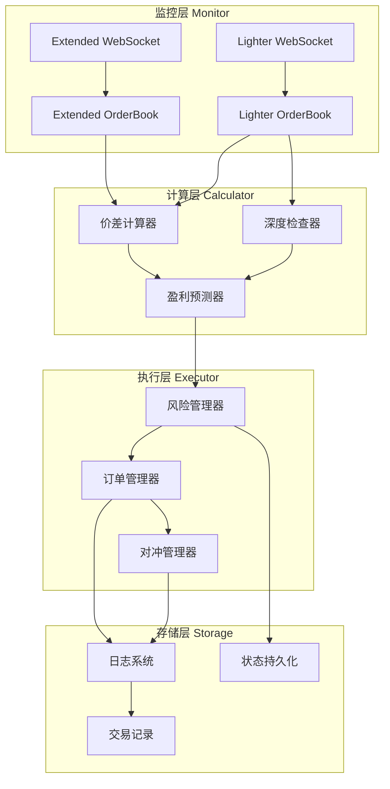
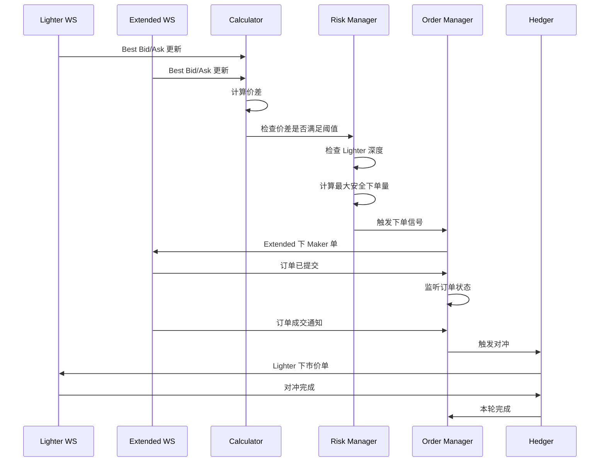

# Extended-Lighter 价差套利策略技术设计方案

## 📋 目录

1. [需求分析](#需求分析)
2. [技术架构](#技术架构)
3. [核心模块设计](#核心模块设计)
4. [API 复用分析](#api-复用分析)
5. [关键算法](#关键算法)
6. [风险控制](#风险控制)
7. [实现路线图](#实现路线图)

---

## 需求分析

### 核心策略概述

**目标**: 利用 Extended 和 Lighter 两个交易所之间的价差进行低风险套利

**角色分配**:
- **Extended (Maker 池)**: 挂单引导价格,享受 0% Maker 费率
- **Lighter (Taker 池)**: 对冲执行,享受 0% Taker 费率

**盈利模型**:
```
Profit = Price_Spread - Slippage - Gas_Cost
```

由于两端手续费为 0,只要价差 > (滑点 + Gas),即可盈利。

### 与现有对冲模式的区别

| 维度 | 现有对冲模式 | 价差套利模式 |
|------|-------------|-------------|
| 触发机制 | 主动循环下单 | 被动监听价差 |
| 下单时机 | 固定迭代次数 | 价差满足阈值时 |
| 价格来源 | Extended 市价 | Lighter 价格 + 价差率 |
| 风险模型 | 快速进出 | 价差锁定 |
| 持仓管理 | 可选 max_position | 严格净持仓 0 |

---

## 技术架构

### 系统架构图



### 数据流图



---

## 核心模块设计

### 1. 配置模块 (`SpreadArbConfig`)

```python
@dataclass
class SpreadArbConfig:
    """价差套利配置"""
    # 基础配置
    ticker: str                          # 交易对 (如 ETH, BTC)
    order_quantity: Decimal              # 单次下单量
    
    # 价差配置
    min_spread_rate: Decimal             # 最小价差率 (如 0.05% = 0.0005)
    latency_buffer: Decimal              # 延迟缓冲 (如 0.01% = 0.0001)
    
    # 风险配置
    max_exposure: Decimal                # 最大敞口
    slippage_tolerance: Decimal          # 最大可接受滑点 (如 0.1%)
    max_lighter_depth_ratio: Decimal     # Lighter 深度比例 (默认 0.5)
    
    # 深度过滤
    min_lighter_depth: Decimal           # Lighter 最小深度 (USDT)
    check_depth_layers: int = 3          # 检查深度层数
    
    # 超时配置
    extended_fill_timeout: int = 10      # Extended 成交超时(秒)
    lighter_hedge_timeout: int = 3       # Lighter 对冲超时(秒)
    
    # 断路器
    max_consecutive_failures: int = 3    # 最大连续失败次数
    cooldown_period: int = 60           # 冷却期(秒)
    
    # 其他
    enable_partial_fill: bool = True     # 允许部分成交
    log_level: str = "INFO"
```

### 2. 价差计算器 (`SpreadCalculator`)

```python
class SpreadCalculator:
    """价差计算与机会识别"""
    
    def __init__(self, config: SpreadArbConfig):
        self.config = config
        self.logger = logging.getLogger("SpreadCalculator")
    
    def calculate_spread_opportunity(
        self,
        extended_bid: Decimal,
        extended_ask: Decimal,
        lighter_bid: Decimal,
        lighter_ask: Decimal
    ) -> Optional[Dict[str, Any]]:
        """
        计算价差机会
        
        返回格式:
        {
            'type': 'buy_extended_sell_lighter' | 'sell_extended_buy_lighter',
            'spread_rate': Decimal,           # 价差率
            'expected_profit_rate': Decimal,  # 预期利润率
            'extended_price': Decimal,        # Extended 挂单价格
            'lighter_price': Decimal,         # Lighter 预期成交价格
            'quantity': Decimal               # 建议下单量
        }
        """
        opportunities = []
        
        # 机会 1: Extended 买入 + Lighter 卖出
        # Extended 挂买单在 bid,Lighter 卖出在 bid
        if lighter_bid > extended_bid:
            spread = lighter_bid - extended_bid
            spread_rate = spread / extended_bid
            
            # 减去延迟缓冲
            expected_profit_rate = spread_rate - self.config.latency_buffer
            
            if expected_profit_rate >= self.config.min_spread_rate:
                opportunities.append({
                    'type': 'buy_extended_sell_lighter',
                    'spread_rate': spread_rate,
                    'expected_profit_rate': expected_profit_rate,
                    'extended_price': extended_bid,  # 在买一挂单
                    'lighter_price': lighter_bid,    # 预期卖给买一
                    'side': 'buy'                    # Extended 方向
                })
        
        # 机会 2: Extended 卖出 + Lighter 买入
        # Extended 挂卖单在 ask,Lighter 买入在 ask
        if extended_ask > lighter_ask:
            spread = extended_ask - lighter_ask
            spread_rate = spread / lighter_ask
            
            # 减去延迟缓冲
            expected_profit_rate = spread_rate - self.config.latency_buffer
            
            if expected_profit_rate >= self.config.min_spread_rate:
                opportunities.append({
                    'type': 'sell_extended_buy_lighter',
                    'spread_rate': spread_rate,
                    'expected_profit_rate': expected_profit_rate,
                    'extended_price': extended_ask,  # 在卖一挂单
                    'lighter_price': lighter_ask,    # 预期买在卖一
                    'side': 'sell'                   # Extended 方向
                })
        
        # 返回最优机会
        if opportunities:
            return max(opportunities, key=lambda x: x['expected_profit_rate'])
        
        return None
    
    def calculate_max_safe_quantity(
        self,
        lighter_orderbook: Dict,
        side: str,
        max_depth_ratio: Decimal
    ) -> Decimal:
        """
        计算在 Lighter 的最大安全下单量
        
        Args:
            lighter_orderbook: Lighter 订单簿 {'bids': {price: size}, 'asks': {price: size}}
            side: 'buy' 或 'sell' (Lighter 对冲方向)
            max_depth_ratio: 最大深度使用比例
        """
        book_side = 'asks' if side == 'buy' else 'bids'
        
        # 获取前 N 档深度
        levels = sorted(
            lighter_orderbook[book_side].items(),
            key=lambda x: x[0],  # 按价格排序
            reverse=(book_side == 'bids')
        )[:self.config.check_depth_layers]
        
        if not levels:
            return Decimal('0')
        
        # 计算总深度
        total_depth = sum(size for _, size in levels)
        
        # 应用深度比例限制
        max_quantity = total_depth * max_depth_ratio
        
        # 不超过配置的下单量
        return min(max_quantity, self.config.order_quantity)
```

### 3. 订单管理器 (`SpreadOrderManager`)

```python
class SpreadOrderManager:
    """订单管理器 - 负责 Extended 端下单"""
    
    def __init__(
        self,
        config: SpreadArbConfig,
        extended_client: ExtendedClient,
        spread_calculator: SpreadCalculator
    ):
        self.config = config
        self.extended_client = extended_client
        self.calculator = spread_calculator
        self.logger = logging.getLogger("OrderManager")
        
        # 状态跟踪
        self.current_order_id = None
        self.current_order_status = None
        self.filled_quantity = Decimal('0')
        self.filled_price = Decimal('0')
    
    async def place_spread_maker_order(
        self,
        side: str,
        price: Decimal,
        quantity: Decimal
    ) -> Dict[str, Any]:
        """
        在 Extended 下价差 maker 单
        
        价格策略:
        - 买单: 挂在 Lighter_Ask * (1 - spread_rate)
        - 卖单: 挂在 Lighter_Bid * (1 + spread_rate)
        """
        self.logger.info(
            f"[Extended] 下 {side.upper()} Maker 单: "
            f"{quantity} @ {price}"
        )
        
        # 重置状态
        self.current_order_status = None
        self.filled_quantity = Decimal('0')
        
        # 下单
        order_result = await self.extended_client.place_open_order(
            contract_id=self.extended_client.contract_id,
            quantity=quantity,
            direction=side
        )
        
        if not order_result.success:
            raise Exception(f"下单失败: {order_result.error_message}")
        
        self.current_order_id = order_result.order_id
        
        return {
            'order_id': order_result.order_id,
            'price': order_result.price,
            'quantity': quantity,
            'side': side
        }
    
    async def wait_for_fill(
        self,
        timeout: int,
        allow_partial: bool = True
    ) -> Dict[str, Any]:
        """
        等待订单成交
        
        Returns:
            {
                'status': 'FILLED' | 'PARTIAL' | 'TIMEOUT',
                'filled_quantity': Decimal,
                'filled_price': Decimal,
                'remaining': Decimal
            }
        """
        start_time = time.time()
        
        while time.time() - start_time < timeout:
            if self.current_order_status == 'FILLED':
                return {
                    'status': 'FILLED',
                    'filled_quantity': self.filled_quantity,
                    'filled_price': self.filled_price,
                    'remaining': Decimal('0')
                }
            
            if allow_partial and self.filled_quantity > 0:
                # 有部分成交,可以提前触发对冲
                if self.current_order_status == 'PARTIALLY_FILLED':
                    return {
                        'status': 'PARTIAL',
                        'filled_quantity': self.filled_quantity,
                        'filled_price': self.filled_price,
                        'remaining': self.config.order_quantity - self.filled_quantity
                    }
            
            await asyncio.sleep(0.5)
        
        # 超时
        return {
            'status': 'TIMEOUT',
            'filled_quantity': self.filled_quantity,
            'filled_price': self.filled_price,
            'remaining': self.config.order_quantity - self.filled_quantity
        }
    
    async def cancel_order(self, order_id: str):
        """取消订单"""
        try:
            result = await self.extended_client.cancel_order(order_id)
            if result.success:
                self.logger.info(f"订单 {order_id} 已取消")
            return result
        except Exception as e:
            self.logger.error(f"取消订单失败: {e}")
            raise
```

### 4. 对冲管理器 (`HedgeManager`)

```python
class HedgeManager:
    """对冲管理器 - 负责 Lighter 端对冲"""
    
    def __init__(
        self,
        config: SpreadArbConfig,
        lighter_client: LighterClient
    ):
        self.config = config
        self.lighter_client = lighter_client
        self.logger = logging.getLogger("HedgeManager")
        
        # 重试配置
        self.max_retries = 3
        self.retry_delay = 1  # seconds
    
    async def execute_hedge(
        self,
        side: str,         # 'buy' or 'sell'
        quantity: Decimal,
        expected_price: Decimal
    ) -> Dict[str, Any]:
        """
        执行 Lighter 对冲
        
        策略:
        1. 使用市价单快速成交
        2. 检查滑点是否在容忍范围内
        3. 最多重试 3 次
        """
        for attempt in range(self.max_retries):
            try:
                self.logger.info(
                    f"[Lighter] 对冲 {side.upper()}: "
                    f"{quantity} @ ~{expected_price} (尝试 {attempt + 1}/{self.max_retries})"
                )
                
                # 下市价单
                order_result = await self.lighter_client.place_market_order(
                    contract_id=self.lighter_client.contract_id,
                    quantity=quantity,
                    side=side
                )
                
                if not order_result.success:
                    raise Exception(f"对冲失败: {order_result.error_message}")
                
                # 等待成交
                await asyncio.sleep(0.5)
                
                # 获取成交信息
                order_info = await self.lighter_client.get_order_info(
                    order_result.order_id
                )
                
                if order_info.status != 'FILLED':
                    raise Exception(f"对冲未成交: {order_info.status}")
                
                filled_price = order_info.price
                
                # 计算滑点
                if side == 'buy':
                    slippage = (filled_price - expected_price) / expected_price
                else:
                    slippage = (expected_price - filled_price) / expected_price
                
                # 检查滑点
                if slippage > self.config.slippage_tolerance:
                    self.logger.warning(
                        f"⚠️ 滑点过大: {slippage:.4%} > {self.config.slippage_tolerance:.4%}"
                    )
                
                return {
                    'success': True,
                    'order_id': order_result.order_id,
                    'filled_price': filled_price,
                    'filled_quantity': quantity,
                    'slippage': slippage
                }
                
            except Exception as e:
                self.logger.error(f"对冲尝试 {attempt + 1} 失败: {e}")
                
                if attempt < self.max_retries - 1:
                    await asyncio.sleep(self.retry_delay)
                else:
                    return {
                        'success': False,
                        'error': str(e),
                        'filled_quantity': Decimal('0')
                    }
```

### 5. 主策略引擎 (`SpreadArbitrageBot`)

```python
class SpreadArbitrageBot:
    """价差套利主引擎"""
    
    def __init__(self, config: SpreadArbConfig):
        self.config = config
        self.logger = logging.getLogger("SpreadArbBot")
        
        # 初始化客户端 (复用现有代码)
        self.extended_client = None
        self.lighter_client = None
        
        # 初始化模块
        self.calculator = SpreadCalculator(config)
        self.order_manager = None  # 连接后初始化
        self.hedge_manager = None   # 连接后初始化
        
        # WebSocket 数据
        self.extended_orderbook = {'bids': {}, 'asks': {}}
        self.lighter_orderbook = {'bids': {}, 'asks': {}}
        
        # 断路器
        self.consecutive_failures = 0
        self.is_paused = False
        self.pause_until = 0
        
        # 统计
        self.stats = {
            'total_opportunities': 0,
            'successful_arbs': 0,
            'failed_arbs': 0,
            'total_profit': Decimal('0'),
            'total_loss': Decimal('0')
        }
    
    async def run(self):
        """主运行循环"""
        try:
            # 1. 初始化
            await self._initialize()
            
            # 2. 启动 WebSocket 监听
            tasks = [
                asyncio.create_task(self._monitor_extended_orderbook()),
                asyncio.create_task(self._monitor_lighter_orderbook()),
                asyncio.create_task(self._strategy_loop())
            ]
            
            # 3. 运行
            await asyncio.gather(*tasks)
            
        except KeyboardInterrupt:
            self.logger.info("用户中断")
        except Exception as e:
            self.logger.error(f"致命错误: {e}")
            self.logger.error(traceback.format_exc())
        finally:
            await self._cleanup()
    
    async def _initialize(self):
        """初始化连接和客户端"""
        self.logger.info("初始化 Extended 客户端...")
        # TODO: 复用现有 Extended 客户端初始化代码
        
        self.logger.info("初始化 Lighter 客户端...")
        # TODO: 复用现有 Lighter 客户端初始化代码
        
        # 初始化管理器
        self.order_manager = SpreadOrderManager(
            self.config,
            self.extended_client,
            self.calculator
        )
        
        self.hedge_manager = HedgeManager(
            self.config,
            self.lighter_client
        )
        
        self.logger.info("✅ 初始化完成")
    
    async def _strategy_loop(self):
        """策略主循环"""
        while True:
            try:
                # 检查断路器
                if self.is_paused:
                    if time.time() < self.pause_until:
                        await asyncio.sleep(1)
                        continue
                    else:
                        self.is_paused = False
                        self.consecutive_failures = 0
                        self.logger.info("🔄 断路器恢复")
                
                # 计算价差机会
                opportunity = self.calculator.calculate_spread_opportunity(
                    extended_bid=max(self.extended_orderbook['bids'].keys()) if self.extended_orderbook['bids'] else Decimal('0'),
                    extended_ask=min(self.extended_orderbook['asks'].keys()) if self.extended_orderbook['asks'] else Decimal('999999'),
                    lighter_bid=max(self.lighter_orderbook['bids'].keys()) if self.lighter_orderbook['bids'] else Decimal('0'),
                    lighter_ask=min(self.lighter_orderbook['asks'].keys()) if self.lighter_orderbook['asks'] else Decimal('999999')
                )
                
                if opportunity:
                    self.stats['total_opportunities'] += 1
                    
                    self.logger.info(
                        f"🎯 发现套利机会: {opportunity['type']} "
                        f"价差率: {opportunity['spread_rate']:.4%} "
                        f"预期利润: {opportunity['expected_profit_rate']:.4%}"
                    )
                    
                    # 执行套利
                    success = await self._execute_arbitrage(opportunity)
                    
                    if success:
                        self.consecutive_failures = 0
                    else:
                        self.consecutive_failures += 1
                        
                        # 触发断路器
                        if self.consecutive_failures >= self.config.max_consecutive_failures:
                            self.is_paused = True
                            self.pause_until = time.time() + self.config.cooldown_period
                            self.logger.warning(
                                f"⚠️ 连续失败 {self.consecutive_failures} 次, "
                                f"触发断路器,暂停 {self.config.cooldown_period} 秒"
                            )
                
                await asyncio.sleep(0.1)  # 100ms 检查间隔
                
            except Exception as e:
                self.logger.error(f"策略循环错误: {e}")
                await asyncio.sleep(1)
    
    async def _execute_arbitrage(self, opportunity: Dict) -> bool:
        """执行套利"""
        try:
            # 1. 检查 Lighter 深度
            safe_quantity = self.calculator.calculate_max_safe_quantity(
                self.lighter_orderbook,
                side='buy' if 'sell_lighter' in opportunity['type'] else 'sell',
                max_depth_ratio=self.config.max_lighter_depth_ratio
            )
            
            if safe_quantity < self.config.order_quantity * Decimal('0.5'):
                self.logger.warning(
                    f"⚠️ Lighter 深度不足: {safe_quantity} < {self.config.order_quantity * Decimal('0.5')}"
                )
                return False
            
            quantity = min(safe_quantity, self.config.order_quantity)
            
            # 2. Extended 下 Maker 单
            order = await self.order_manager.place_spread_maker_order(
                side=opportunity['side'],
                price=opportunity['extended_price'],
                quantity=quantity
            )
            
            # 3. 等待成交
            fill_result = await self.order_manager.wait_for_fill(
                timeout=self.config.extended_fill_timeout,
                allow_partial=self.config.enable_partial_fill
            )
            
            if fill_result['status'] == 'TIMEOUT' and fill_result['filled_quantity'] == 0:
                # 完全未成交,取消订单
                await self.order_manager.cancel_order(order['order_id'])
                return False
            
            # 4. 执行对冲
            hedge_side = 'sell' if opportunity['side'] == 'buy' else 'buy'
            hedge_result = await self.hedge_manager.execute_hedge(
                side=hedge_side,
                quantity=fill_result['filled_quantity'],
                expected_price=opportunity['lighter_price']
            )
            
            if not hedge_result['success']:
                self.stats['failed_arbs'] += 1
                self.logger.error("❌ 对冲失败!")
                return False
            
            # 5. 计算实际盈亏
            actual_profit = self._calculate_pnl(
                extended_price=fill_result['filled_price'],
                lighter_price=hedge_result['filled_price'],
                quantity=fill_result['filled_quantity'],
                side=opportunity['side']
            )
            
            if actual_profit > 0:
                self.stats['successful_arbs'] += 1
                self.stats['total_profit'] += actual_profit
            else:
                self.stats['total_loss'] += abs(actual_profit)
            
            self.logger.info(
                f"✅ 套利完成! "
                f"数量: {fill_result['filled_quantity']} "
                f"Extended: {fill_result['filled_price']} "
                f"Lighter: {hedge_result['filled_price']} "
                f"盈亏: ${actual_profit:.2f}"
            )
            
            return True
            
        except Exception as e:
            self.logger.error(f"执行套利失败: {e}")
            self.stats['failed_arbs'] += 1
            return False
    
    def _calculate_pnl(
        self,
        extended_price: Decimal,
        lighter_price: Decimal,
        quantity: Decimal,
        side: str
    ) -> Decimal:
        """计算盈亏"""
        if side == 'buy':
            # Extended 买入, Lighter 卖出
            pnl = (lighter_price - extended_price) * quantity
        else:
            # Extended 卖出, Lighter 买入
            pnl = (extended_price - lighter_price) * quantity
        
        return pnl
```

---

## API 复用分析

### 可直接复用的组件

| 组件 | 文件 | 复用度 | 说明 |
|------|------|--------|------|
| Extended 客户端 | `exchanges/extended.py` | 100% | WebSocket, 下单, 查询 |
| Lighter 客户端 | `exchanges/lighter.py` | 100% | WebSocket, 下单, 查询 |
| 日志系统 | `helpers/logger.py` | 100% | CSV 记录, 控制台输出 |
| 通知系统 | `helpers/telegram_bot.py` | 100% | Telegram/Lark 通知 |
| WebSocket 订单簿 | `hedge_mode_ext.py` | 80% | 需调整订单簿更新逻辑 |

### 需要新增的模块

1. **SpreadCalculator**: 价差计算与机会识别
2. **SpreadOrderManager**: 价差订单管理
3. **HedgeManager**: 对冲执行管理
4. **RiskManager**: 风险控制模块

### 现有代码修改点

```python
# 从 hedge_mode_ext.py 复用
class SpreadArbitrageBot:
    def __init__(self):
        # ✅ 复用: Extended 客户端初始化
        self.extended_client = ExtendedClient(config)
        
        # ✅ 复用: Lighter 客户端初始化  
        self.lighter_client = SignerClient(...)
        
        # ✅ 复用: Extended WebSocket 订单簿处理
        self.handle_extended_order_book_update = ...  # 从 hedge_mode_ext.py
        
        # ✅ 复用: Lighter WebSocket 订单簿处理
        self.handle_lighter_ws = ...  # 从 hedge_mode_ext.py
        
        # 🆕 新增: 价差计算器
        self.spread_calculator = SpreadCalculator(config)
```

---

## 关键算法

### 1. 价差计算算法

```python
def calculate_spread(extended_price, lighter_price, side):
    """
    计算实际可获取的价差率
    
    Args:
        extended_price: Extended 挂单价格
        lighter_price: Lighter 预期成交价格
        side: Extended 方向 ('buy' or 'sell')
    
    Returns:
        spread_rate: 价差率
    """
    if side == 'buy':
        # Extended 买入 @ extended_price
        # Lighter 卖出 @ lighter_price (Lighter bid)
        spread = lighter_price - extended_price
        spread_rate = spread / extended_price
    else:
        # Extended 卖出 @ extended_price
        # Lighter 买入 @ lighter_price (Lighter ask)
        spread = extended_price - lighter_price
        spread_rate = spread / lighter_price
    
    return spread_rate
```

### 2. 最优挂单价格算法

```python
def calculate_optimal_maker_price(
    lighter_ref_price: Decimal,
    spread_rate: Decimal,
    side: str,
    tick_size: Decimal
) -> Decimal:
    """
    计算 Extended 最优挂单价格
    
    目标: 尽量贴近 BBO,提高成交概率,同时保持价差
    """
    if side == 'buy':
        # Extended 买入,应该比 Lighter 卖价 低一个价差
        # 但要尽量贴近 Extended 买一
        target_price = lighter_ref_price * (1 - spread_rate)
    else:
        # Extended 卖出,应该比 Lighter 买价 高一个价差
        # 但要尽量贴近 Extended 卖一
        target_price = lighter_ref_price * (1 + spread_rate)
    
    # 舍入到 tick size
    rounded_price = (target_price / tick_size).quantize(Decimal('1')) * tick_size
    
    return rounded_price
```

### 3. 深度检查算法

```python
def check_lighter_depth(
    orderbook: Dict,
    side: str,
    required_quantity: Decimal,
    max_levels: int = 3
) -> Tuple[bool, Decimal, Decimal]:
    """
    检查 Lighter 深度是否充足
    
    Returns:
        (is_sufficient, available_quantity, avg_price)
    """
    book_side = 'asks' if side == 'buy' else 'bids'
    
    # 按价格排序
    levels = sorted(
        orderbook[book_side].items(),
        key=lambda x: x[0],
        reverse=(book_side == 'bids')
    )[:max_levels]
    
    cumulative_qty = Decimal('0')
    cumulative_value = Decimal('0')
    
    for price, size in levels:
        cumulative_qty += size
        cumulative_value += price * size
        
        if cumulative_qty >= required_quantity:
            # 深度充足
            avg_price = cumulative_value / cumulative_qty
            return True, cumulative_qty, avg_price
    
    # 深度不足
    avg_price = cumulative_value / cumulative_qty if cumulative_qty > 0 else Decimal('0')
    return False, cumulative_qty, avg_price
```

---

## 风险控制

### 1. 深度保护

```python
# 单笔下单量不超过 Lighter 深度的 50%
max_quantity = lighter_available_depth * 0.5
quantity = min(config.order_quantity, max_quantity)
```

### 2. 滑点保护

```python
# 对冲后检查滑点
actual_slippage = abs(filled_price - expected_price) / expected_price

if actual_slippage > config.slippage_tolerance:
    logger.warning(f"滑点超限: {actual_slippage:.4%}")
    # 记录但继续执行
```

### 3. 断路器

```python
# 连续失败 3 次后暂停 60 秒
if consecutive_failures >= 3:
    pause_trading(duration=60)
    consecutive_failures = 0
```

### 4. 仓位监控

```python
# 严格保持净持仓为 0
extended_position = await extended_client.get_account_positions()
lighter_position = await lighter_client.get_account_positions()

net_position = extended_position + lighter_position

if abs(net_position) > config.order_quantity * 2:
    logger.error(f"仓位不平衡: {net_position}")
    trigger_alert()
    pause_trading()
```

---

## 实现路线图

### Phase 1: 核心功能 (1-2 天)

- [x] 理解需求
- [ ] 创建 `SpreadArbConfig` 配置类
- [ ] 实现 `SpreadCalculator` 价差计算
- [ ] 实现 `SpreadOrderManager` 订单管理
- [ ] 实现 `HedgeManager` 对冲管理

### Phase 2: 主引擎 (1-2 天)

- [ ] 实现 `SpreadArbitrageBot` 主引擎
- [ ] 集成 Extended WebSocket 订单簿
- [ ] 集成 Lighter WebSocket 订单簿
- [ ] 实现策略主循环

### Phase 3: 风险控制 (1 天)

- [ ] 深度检查
- [ ] 滑点保护
- [ ] 断路器实现
- [ ] 仓位监控

### Phase 4: 测试与优化 (2-3 天)

- [ ] 小金额测试 (10-50 USDT)
- [ ] 日志完善
- [ ] 性能优化
- [ ] 参数调优

### Phase 5: 上线部署 (1 天)

- [ ] 生产环境配置
- [ ] 监控告警
- [ ] 文档完善

---

## 预期效果

### 成本结构

| 项目 | 数值 | 说明 |
|------|------|------|
| Extended Maker 费率 | 0% | 零手续费 |
| Lighter Taker 费率 | 0% | 零手续费 |
| 滑点成本 | 0.05% | 预期平均滑点 |
| Gas 成本 | ≈$0.1 | L2 链 Gas |

### 盈利模型

```
单次盈利 = (价差率 - 滑点率) × 交易量 - Gas

示例:
- 价差率: 0.15%
- 滑点率: 0.05%
- 交易量: 1000 USDT
- Gas: $0.1

盈利 = (0.15% - 0.05%) × 1000 - 0.1
     = 1.0 - 0.1
     = $0.9
```

### 关键指标

- **最小价差率**: 0.1% (覆盖滑点 + Gas)
- **日均机会**: 10-50 次 (取决于市场波动)
- **单次交易量**: 500-2000 USDT
- **预期日收益**: $10-50

---

## 下一步

请您确认以下问题:

1. **参数配置**: 上述默认参数是否合适?
   - `min_spread_rate`: 0.05%
   - `order_quantity`: 多少?
   - `max_lighter_depth_ratio`: 0.5

2. **实现优先级**: 是否按照上述路线图实施?

3. **测试计划**: 是否先用小金额测试 (如 10 USDT)?

确认后我将开始编码实现!
