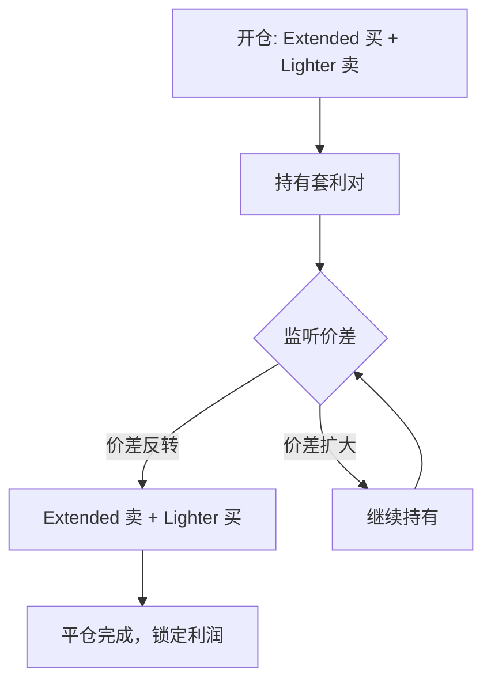
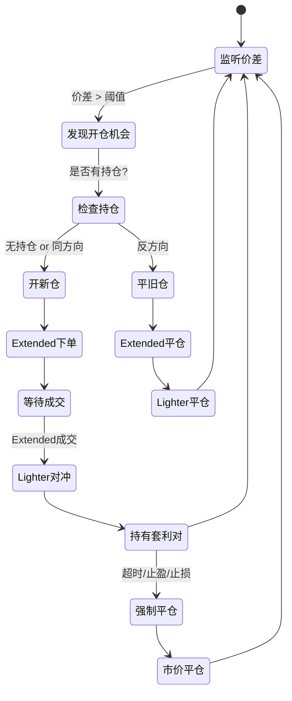

# 价差套利持仓管理策略

## 核心问题解析

### 问题 1: 一单成单后，如果有另一单该怎么操作？

这取决于新机会的方向：

#### 情况 A：同方向套利机会

**已有持仓**:
- Extended: 买入 1 ETH @ $3000
- Lighter: 卖出 1 ETH @ $3001
- 价差: +$1

**新机会**: 又出现 Extended 买 + Lighter 卖的机会
- Extended: 可买入 @ $2999
- Lighter: 可卖出 @ $3000.5

**操作策略**:
```python
# 选项 1: 累积持仓（激进）
继续开新仓 → Extended 总仓位 2 ETH，Lighter 总仓位 -2 ETH

# 选项 2: 拒绝新单（保守）
等待当前持仓平仓后再接受新机会

# ✅ 推荐: 根据 max_position 限制
if abs(current_position) + new_quantity <= max_position:
    接受新机会
else:
    拒绝新机会
```

#### 情况 B：反方向套利机会（✨ 这是平仓机会！）

**已有持仓**:
- Extended: 买入 1 ETH @ $3000
- Lighter: 卖出 1 ETH @ $3001

**新机会**: 出现 Extended 卖 + Lighter 买的机会
- Extended: 可卖出 @ $3002
- Lighter: 可买入 @ $3001

**这就是平仓的最佳时机！**

**操作策略**:
```python
# ✅ 优先平仓逻辑
if 新机会方向 == 当前持仓反方向:
    # 这是平仓机会
    平仓数量 = min(新机会数量, 当前持仓数量)
    
    # Extended 卖出 1 ETH @ $3002
    # Lighter 买入 1 ETH @ $3001
    
    # 计算盈亏
    # Extended: $3002 - $3000 = +$2
    # Lighter: $3001 - $3001 = $0
    # 总盈利: $2
```

---

## 平仓策略设计

### 策略 1: 价差反转平仓（推荐）

**原理**: 利用价差的自然波动，等待反向价差出现时平仓

**流程**:


**代码逻辑**:
```python
class SpreadPair:
    """套利对"""
    def __init__(self):
        self.extended_side = 'buy'      # Extended 方向
        self.extended_price = 3000      # Extended 成交价
        self.lighter_price = 3001       # Lighter 成交价
        self.quantity = 1.0             # 数量
        self.open_time = time.time()    # 开仓时间
    
    def should_close(self, new_opportunity):
        """判断是否应该平仓"""
        # 检查方向是否相反
        if self.extended_side == 'buy' and new_opportunity['side'] == 'sell':
            return True
        elif self.extended_side == 'sell' and new_opportunity['side'] == 'buy':
            return True
        return False
    
    def calculate_profit(self, close_extended_price, close_lighter_price):
        """计算平仓盈亏"""
        if self.extended_side == 'buy':
            # 开仓: Extended 买 @ 3000, Lighter 卖 @ 3001
            # 平仓: Extended 卖 @ close_extended_price, Lighter 买 @ close_lighter_price
            extended_pnl = (close_extended_price - self.extended_price) * self.quantity
            lighter_pnl = (self.lighter_price - close_lighter_price) * self.quantity
        else:
            # 开仓: Extended 卖 @ 3000, Lighter 买 @ 3001
            # 平仓: Extended 买 @ close_extended_price, Lighter 卖 @ close_lighter_price
            extended_pnl = (self.extended_price - close_extended_price) * self.quantity
            lighter_pnl = (close_lighter_price - self.lighter_price) * self.quantity
        
        return extended_pnl + lighter_pnl
```

### 策略 2: 固定时间/价格止盈（备选）

**原理**: 如果价差长时间不反转，设置强制平仓条件

**触发条件**:
1. **时间止盈**: 持仓时间 > 30 分钟 → 强制市价平仓
2. **盈利止盈**: 浮盈 > 目标利润的 80% → 提前平仓
3. **止损保护**: 浮亏 > -$5 → 强制止损

```python
def check_force_close(self, pair: SpreadPair, current_extended_price, current_lighter_price):
    """检查是否需要强制平仓"""
    # 1. 时间止盈
    holding_time = time.time() - pair.open_time
    if holding_time > 1800:  # 30 分钟
        return True, "时间止盈"
    
    # 2. 计算浮动盈亏
    unrealized_pnl = pair.calculate_profit(current_extended_price, current_lighter_price)
    
    # 3. 盈利止盈
    target_profit = pair.quantity * 2  # 目标 $2
    if unrealized_pnl >= target_profit * 0.8:
        return True, "盈利止盈"
    
    # 4. 止损保护
    if unrealized_pnl < -5:
        return True, "止损"
    
    return False, None
```

---

## 完整交易流程

### 状态机设计



### 伪代码实现

```python
class SpreadArbitrageBot:
    def __init__(self):
        self.open_pairs = []  # 持有的套利对列表
        self.max_pairs = 3    # 最大同时持有套利对数量
    
    async def strategy_loop(self):
        """主策略循环"""
        while True:
            # 1. 计算当前价差机会
            opportunity = self.calculate_spread_opportunity()
            
            if not opportunity:
                await asyncio.sleep(0.1)
                continue
            
            # 2. 检查是否有反向持仓（平仓机会）
            close_pair = self.find_opposite_pair(opportunity)
            
            if close_pair:
                # 优先平仓
                await self.close_pair(close_pair, opportunity)
            else:
                # 检查是否可以开新仓
                if len(self.open_pairs) < self.max_pairs:
                    await self.open_new_pair(opportunity)
            
            # 3. 检查强制平仓条件
            await self.check_force_close_all()
            
            await asyncio.sleep(0.1)
    
    def find_opposite_pair(self, opportunity):
        """查找反向持仓"""
        for pair in self.open_pairs:
            if pair.should_close(opportunity):
                return pair
        return None
    
    async def open_new_pair(self, opportunity):
        """开新的套利对"""
        # 1. Extended 下 Maker 单
        extended_order = await self.order_manager.place_spread_maker_order(
            side=opportunity['side'],
            price=opportunity['extended_price'],
            quantity=opportunity['quantity']
        )
        
        # 2. 等待成交
        fill_result = await self.order_manager.wait_for_fill(timeout=10)
        
        if fill_result['status'] in ['FILLED', 'PARTIAL']:
            # 3. Lighter 对冲
            hedge_side = 'sell' if opportunity['side'] == 'buy' else 'buy'
            hedge_result = await self.hedge_manager.execute_hedge(
                side=hedge_side,
                quantity=fill_result['filled_quantity'],
                expected_price=opportunity['lighter_price']
            )
            
            # 4. 创建套利对记录
            pair = SpreadPair(
                extended_side=opportunity['side'],
                extended_price=fill_result['filled_price'],
                lighter_price=hedge_result['filled_price'],
                quantity=fill_result['filled_quantity']
            )
            
            self.open_pairs.append(pair)
            
            self.logger.info(
                f"✅ 开仓套利对 #{len(self.open_pairs)}: "
                f"{pair.extended_side.upper()} {pair.quantity} ETH "
                f"Extended@{pair.extended_price} Lighter@{pair.lighter_price}"
            )
    
    async def close_pair(self, pair, opportunity):
        """平仓套利对"""
        # 1. Extended 平仓
        close_side = 'sell' if pair.extended_side == 'buy' else 'buy'
        extended_close = await self.order_manager.place_spread_maker_order(
            side=close_side,
            price=opportunity['extended_price'],
            quantity=pair.quantity
        )
        
        # 2. 等待成交
        fill_result = await self.order_manager.wait_for_fill(timeout=10)
        
        # 3. Lighter 平仓
        hedge_side = 'buy' if pair.extended_side == 'buy' else 'sell'
        lighter_close = await self.hedge_manager.execute_hedge(
            side=hedge_side,
            quantity=pair.quantity,
            expected_price=opportunity['lighter_price']
        )
        
        # 4. 计算盈亏
        profit = pair.calculate_profit(
            fill_result['filled_price'],
            lighter_close['filled_price']
        )
        
        self.logger.info(
            f"💰 平仓套利对: 盈亏 ${profit:.2f} "
            f"持仓时间 {time.time() - pair.open_time:.0f}秒"
        )
        
        # 5. 从列表中移除
        self.open_pairs.remove(pair)
        
        # 6. 记录统计
        self.stats['total_profit'] += profit
    
    async def check_force_close_all(self):
        """检查所有套利对是否需要强制平仓"""
        for pair in self.open_pairs[:]:  # 复制列表避免迭代时修改
            # 获取当前价格
            extended_bid, extended_ask = await self.get_extended_bbo()
            lighter_bid, lighter_ask = await self.get_lighter_bbo()
            
            # 计算当前价格
            if pair.extended_side == 'buy':
                current_extended = extended_ask  # 买入的平仓是卖出
                current_lighter = lighter_bid
            else:
                current_extended = extended_bid
                current_lighter = lighter_ask
            
            # 检查是否需要强制平仓
            should_close, reason = self.check_force_close(
                pair, current_extended, current_lighter
            )
            
            if should_close:
                self.logger.warning(f"⚠️ 触发强制平仓: {reason}")
                await self.force_close_pair(pair)
    
    async def force_close_pair(self, pair):
        """强制市价平仓"""
        # 市价平仓逻辑...
        pass
```

---

## 配置更新

```python
@dataclass
class SpreadArbConfig:
    # 基础配置
    ticker: str = 'ETH'
    order_quantity_usdt: Decimal = Decimal('100')  # ✅ 单次下单 USDT 值
    
    # 价差配置
    min_spread_rate: Decimal = Decimal('0.0005')  # ✅ 0.05% 最小价差率
    latency_buffer: Decimal = Decimal('0.0001')   # 0.01% 延迟缓冲
    
    # 持仓管理
    max_open_pairs: int = 3                        # 最大同时持有套利对数量
    max_total_position_usdt: Decimal = Decimal('500')  # 最大总持仓 USDT
    
    # 平仓策略
    enable_time_close: bool = True                 # 启用时间止盈
    max_holding_time: int = 1800                   # 最大持仓时间(秒) 30分钟
    
    enable_profit_target: bool = True              # 启用盈利目标
    profit_target_rate: Decimal = Decimal('0.002')  # 目标盈利率 0.2%
    
    enable_stop_loss: bool = True                  # 启用止损
    stop_loss_usdt: Decimal = Decimal('5')         # 止损金额 $5
    
    # 优先级
    prioritize_closing: bool = True                # 优先平仓而非开仓
```

---

## 答案总结

### Q1: 一单成单后，如果有另一单该怎么操作？

**答**: 
1. **检查方向**: 
   - 如果新机会是**反方向** → **优先平仓**（这就是赚钱的时机！）
   - 如果新机会是**同方向** → 根据 `max_open_pairs` 决定是否开新仓
   
2. **持仓限制**: 
   - 同时持有套利对数量 ≤ `max_open_pairs` (默认 3)
   - 总持仓价值 ≤ `max_total_position_usdt` (默认 $500)

### Q2: 第一单什么时候止盈？

**答**: 三种情况触发平仓
1. **价差反转**（推荐）: 反方向价差机会出现时 → 立即平仓
2. **时间止盈**: 持仓超过 30 分钟 → 强制市价平仓
3. **盈利/止损**: 达到目标盈利 or 触碰止损 → 强制平仓

### Q3: 止盈的顺序是怎样的？

**答**: 
```
优先级 1: 反方向价差机会（优先平仓）
  ↓
优先级 2: 强制平仓条件（时间/盈利/止损）
  ↓
优先级 3: 开新仓（如果没有平仓机会）
```

---

## 下一步

我将更新完整的技术设计方案，加入持仓管理和平仓策略。您觉得这个逻辑合理吗？需要调整吗？
