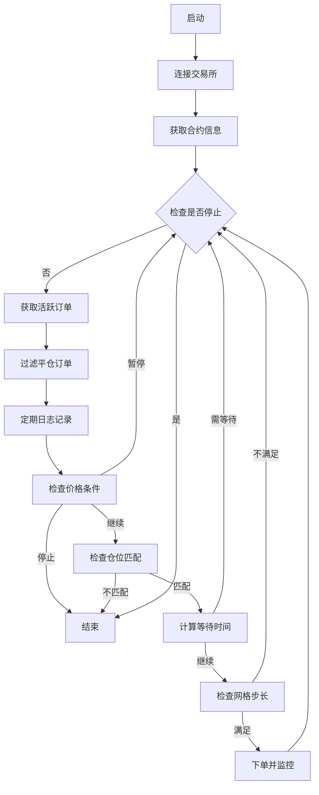
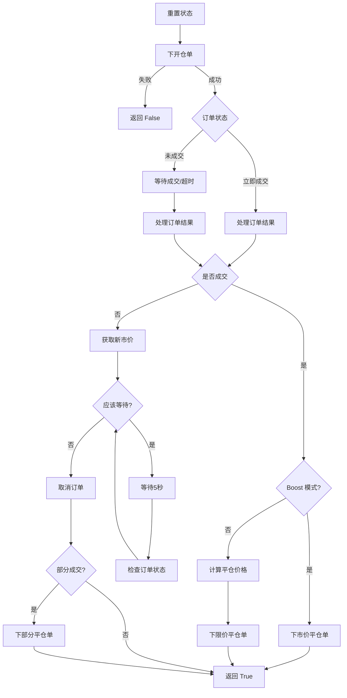
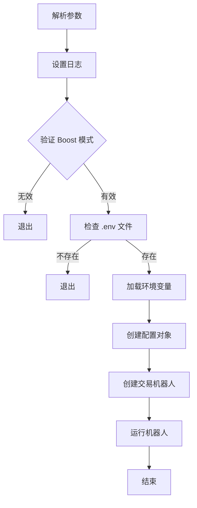
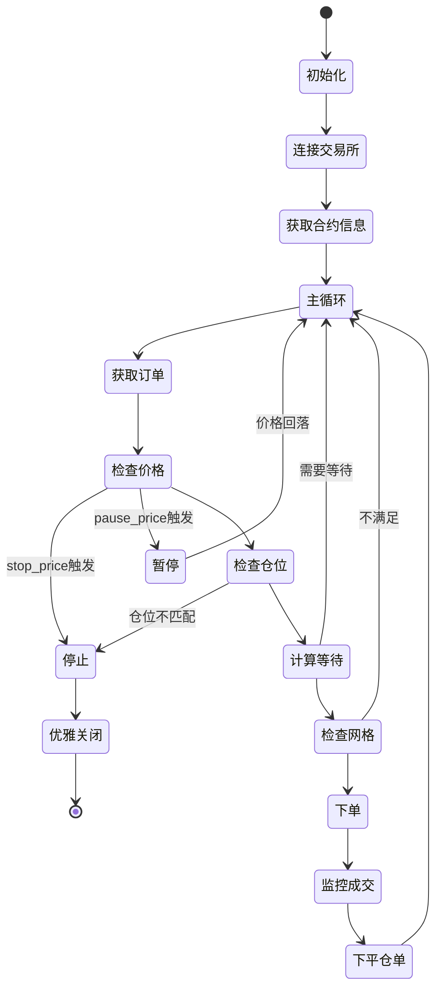

# 核心交易模块

## 模块概述

核心交易模块是整个项目的中枢,负责实现自动化交易的核心逻辑。该模块封装了订单管理、风险控制、策略执行等关键功能。

## 核心文件

### 1. `trading_bot.py`

核心交易机器人实现,包含主要的交易逻辑。

#### 1.1 主要类

##### `TradingConfig` (数据类)

交易配置类,存储所有交易参数:

```python
@dataclass
class TradingConfig:
    ticker: str              # 交易对符号 (如 ETH, BTC)
    contract_id: str         # 合约 ID
    quantity: Decimal        # 每笔订单数量
    take_profit: Decimal     # 止盈百分比
    tick_size: Decimal       # 最小价格变动单位
    direction: str           # 交易方向 (buy/sell)
    max_orders: int          # 最大活跃订单数
    wait_time: int           # 订单间等待时间(秒)
    exchange: str            # 交易所名称
    grid_step: Decimal       # 网格步长
    stop_price: Decimal      # 停止交易价格
    pause_price: Decimal     # 暂停交易价格
    boost_mode: bool         # Boost 模式开关
```

**关键属性**:
- `close_order_side`: 计算属性,根据交易方向返回平仓方向

##### `OrderMonitor` (数据类)

订单监控状态类,用于跟踪订单执行状态:

```python
@dataclass
class OrderMonitor:
    order_id: Optional[str] = None      # 订单 ID
    filled: bool = False                # 是否已成交
    filled_price: Optional[Decimal]     # 成交价格
    filled_qty: Decimal = 0.0          # 成交数量
```

##### `TradingBot` (主类)

交易机器人主类,实现完整的交易逻辑。

#### 1.2 核心方法

##### 初始化与配置

**`__init__(self, config: TradingConfig)`**
- 初始化日志系统
- 创建交易所客户端 (通过工厂模式)
- 初始化交易状态变量
- 设置 WebSocket 处理器

**`_setup_websocket_handlers(self)`**
- 注册订单更新回调函数
- 处理订单状态变化 (FILLED, CANCELED, PARTIALLY_FILLED)
- 线程安全的事件触发机制

##### 主交易逻辑

**`run(self)` - 主交易循环**



**执行流程详解**:

1. **连接阶段**: 
   - 调用 `exchange_client.connect()` 建立 WebSocket 连接
   - 获取合约属性 (contract_id, tick_size)
   - 记录配置信息

2. **循环监控**:
   - 获取活跃订单列表
   - 筛选平仓订单
   - 定期记录状态

3. **价格检查**:
   - 检查是否达到停止价格 → 退出
   - 检查是否达到暂停价格 → 等待

4. **仓位验证**:
   - 比较持仓数量与活跃平仓单数量
   - 差异超过阈值 → 发送警报并停止

5. **下单决策**:
   - 计算等待时间
   - 检查网格步长条件
   - 执行下单

##### 订单管理

**`_place_and_monitor_open_order(self) -> bool`**

下单并监控订单执行的完整流程:



**关键逻辑**:

1. **订单下达**:
   ```python
   order_result = await self.exchange_client.place_open_order(
       self.config.contract_id,
       self.config.quantity,
       self.config.direction
   )
   ```

2. **成交监控**:
   - 使用 `asyncio.Event` (`order_filled_event`) 等待 WebSocket 回调
   - 超时时间 10 秒

3. **部分成交处理**:
   - 订单未完全成交时,等待价格不利再取消
   - 只对成交部分下平仓单

4. **平仓单计算**:
   ```python
   # 看多时
   close_price = filled_price * (1 + take_profit/100)
   
   # 看空时
   close_price = filled_price * (1 - take_profit/100)
   ```

**`_handle_order_result(self, order_result) -> bool`**

处理订单结果,包括成交和部分成交情况。

##### 风险控制

**`_calculate_wait_time(self) -> Decimal`**

动态计算下单等待时间:

```python
# 根据活跃订单比例动态调整
if active_orders / max_orders >= 2/3:
    cool_down_time = 2 * wait_time
elif active_orders / max_orders >= 1/3:
    cool_down_time = wait_time
elif active_orders / max_orders >= 1/6:
    cool_down_time = wait_time / 2
else:
    cool_down_time = wait_time / 4
```

**优势**:
- 活跃订单多时增加等待时间,避免过度风险
- 活跃订单少时减少等待时间,提高交易频率

**`_meet_grid_step_condition(self) -> bool`**

检查是否满足网格步长条件:

```python
# 看多时: 新订单的平仓价需要比最低平仓单低 grid_step%
if direction == "buy":
    new_close_price = best_ask * (1 + take_profit/100)
    return next_close_price / new_close_price > 1 + grid_step/100

# 看空时: 新订单的平仓价需要比最高平仓单高 grid_step%
elif direction == "sell":
    new_close_price = best_bid * (1 - take_profit/100)
    return new_close_price / next_close_price > 1 + grid_step/100
```

**作用**:
- 防止平仓订单过于密集
- 提高平仓订单的成交概率
- 避免在狭窄价格区间内堆积订单

**`_check_price_condition(self) -> (bool, bool)`**

检查价格停止/暂停条件:

```python
# 看多时
if direction == "buy":
    if best_ask >= stop_price:
        stop_trading = True
    if best_ask >= pause_price:
        pause_trading = True

# 看空时逻辑相反
```

##### 监控与日志

**`_log_status_periodically(self)`**

定期记录状态并检查仓位:

- 每 60 秒记录一次
- 输出内容:
  - 当前持仓
  - 活跃平仓单总量
  - 活跃订单数量
- **仓位检查**:
  ```python
  if abs(position - active_close_amount) > 2 * quantity:
      # 发送错误通知
      # 停止交易
  ```

##### 通知系统

**`send_notification(self, message: str)`**

发送通知到 Telegram 和飞书:

```python
# Lark (飞书)
if lark_token:
    await lark_bot.send_text(message)

# Telegram
if telegram_token and telegram_chat_id:
    tg_bot.send_text(message)
```

**通知场景**:
- 仓位不匹配警报
- 达到停止价格通知
- 其他异常情况

##### 生命周期管理

**`graceful_shutdown(self, reason: str)`**

优雅关闭机器人:

```python
async def graceful_shutdown(self, reason: str):
    self.logger.log(f"Starting graceful shutdown: {reason}")
    self.shutdown_requested = True
    await self.exchange_client.disconnect()
```

### 2. `runbot.py`

程序入口文件,负责参数解析和初始化。

#### 2.1 主要功能

**`parse_arguments()`**

解析命令行参数:

```python
parser.add_argument('--exchange', choices=ExchangeFactory.get_supported_exchanges())
parser.add_argument('--ticker', default='ETH')
parser.add_argument('--quantity', type=Decimal, default=0.1)
parser.add_argument('--take-profit', type=Decimal, default=0.02)
parser.add_argument('--direction', choices=['buy', 'sell'], default='buy')
parser.add_argument('--max-orders', type=int, default=40)
parser.add_argument('--wait-time', type=int, default=450)
parser.add_argument('--grid-step', default='-100')
parser.add_argument('--stop-price', type=Decimal, default=-1)
parser.add_argument('--pause-price', type=Decimal, default=-1)
parser.add_argument('--boost', action='store_true')
```

**`setup_logging(log_level: str)`**

配置日志系统:

- 设置根日志级别
- 抑制 websockets、urllib3、requests 的 DEBUG 日志
- 防止日志重复

**`main()`**

主函数流程:



## 关键设计亮点

### 1. 异步编程

全面使用 `async/await`:
- 非阻塞 I/O 操作
- 高效的并发处理
- 与 WebSocket 天然契合

### 2. 事件驱动

使用 `asyncio.Event` 实现事件驱动:

```python
# 设置事件
self.order_filled_event = asyncio.Event()

# WebSocket 回调触发
self.loop.call_soon_threadsafe(self.order_filled_event.set)

# 主线程等待
await asyncio.wait_for(self.order_filled_event.wait(), timeout=10)
```

**优势**:
- 实时响应订单变化
- 避免轮询带来的延迟
- 线程安全

### 3. 动态风险调整

根据当前状态动态调整策略:
- 活跃订单多 → 增加等待时间
- 活跃订单少 → 减少等待时间
- 价格不利 → 暂停或停止交易

### 4. 容错机制

- **重试机制**: 使用 `tenacity` 库实现自动重试
- **异常处理**: 全面的 try-except 覆盖
- **优雅关闭**: 确保资源正确释放

## 使用示例

### 基础用法

```bash
python runbot.py \
  --exchange edgex \
  --ticker ETH \
  --quantity 0.1 \
  --take-profit 0.02 \
  --max-orders 40 \
  --wait-time 450
```

### 带网格步长

```bash
python runbot.py \
  --exchange backpack \
  --ticker BTC \
  --quantity 0.05 \
  --grid-step 0.5 \
  --max-orders 50
```

### 带停止价格

```bash
python runbot.py \
  --exchange extended \
  --ticker ETH \
  --direction buy \
  --stop-price 4000 \
  --pause-price 3800
```

### Boost 模式

```bash
python runbot.py \
  --exchange aster \
  --ticker ETH \
  --boost
```

## 流程图总结

### 完整交易循环



## 性能考虑

1. **连接复用**: WebSocket 连接保持持久化
2. **异步 I/O**: 避免阻塞操作
3. **事件驱动**: 减少轮询开销
4. **日志节流**: 只在必要时记录详细信息

## 潜在优化方向

1. **订单簿深度分析**: 根据订单簿调整下单价格
2. **自适应止盈**: 根据市场波动动态调整止盈水平
3. **多币对支持**: 同时运行多个交易对
4. **机器学习**: 预测最佳下单时机
