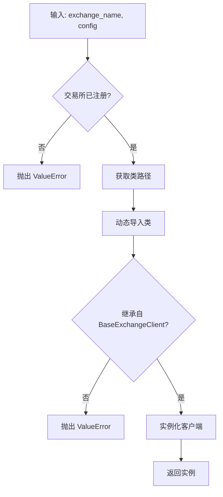

# 交易所适配器模块

## 模块概述

交易所适配器模块实现了与多个去中心化永续合约交易所的对接,采用**工厂模式**和**抽象基类**设计,提供统一的接口来操作不同的交易所。

## 设计模式

### 1. 抽象基类模式

通过 `BaseExchangeClient` 定义统一接口,所有交易所客户端都继承此基类。

### 2. 工厂模式

通过 `ExchangeFactory` 动态创建交易所客户端实例,实现解耦和可扩展性。

## 核心文件

### 1. `exchanges/base.py`

定义抽象基类和标准数据结构。

#### 1.1 数据结构

##### `OrderResult` - 订单结果

```python
@dataclass
class OrderResult:
    success: bool                      # 操作是否成功
    order_id: Optional[str] = None     # 订单 ID
    side: Optional[str] = None         # 订单方向 (buy/sell)
    size: Optional[Decimal] = None     # 订单数量
    price: Optional[Decimal] = None    # 订单价格
    status: Optional[str] = None       # 订单状态
    error_message: Optional[str] = None # 错误信息
    filled_size: Optional[Decimal] = None # 已成交数量
```

**状态值**:
- `OPEN`: 订单已提交,等待成交
- `FILLED`: 订单完全成交
- `PARTIALLY_FILLED`: 订单部分成交
- `CANCELED`: 订单已取消

##### `OrderInfo` - 订单信息

```python
@dataclass
class OrderInfo:
    order_id: str              # 订单 ID
    side: str                  # 订单方向
    size: Decimal              # 订单数量
    price: Decimal             # 订单价格
    status: str                # 订单状态
    filled_size: Decimal = 0.0      # 已成交数量
    remaining_size: Decimal = 0.0   # 剩余数量
    cancel_reason: str = ''         # 取消原因
```

#### 1.2 重试装饰器

##### `query_retry()` 函数

为 API 调用提供自动重试机制:

```python
@query_retry(
    default_return=None,
    exception_type=(Exception,),
    max_attempts=5,
    min_wait=1,
    max_wait=10,
    reraise=False
)
async def some_api_call():
    # API 调用逻辑
```

**参数说明**:
- `default_return`: 重试失败后的默认返回值
- `exception_type`: 需要重试的异常类型
- `max_attempts`: 最大重试次数
- `min_wait`: 最小等待时间(秒)
- `max_wait`: 最大等待时间(秒)
- `reraise`: 是否在最后一次失败后重新抛出异常

**重试策略**:
- 指数退避: 等待时间以指数增长
- 自动重试: 遇到指定异常自动重试
- 日志记录: 记录重试信息

#### 1.3 抽象基类

##### `BaseExchangeClient` (ABC)

所有交易所客户端的基类。

**核心方法**:

```python
class BaseExchangeClient(ABC):
    
    def __init__(self, config: Dict[str, Any])
        """初始化交易所客户端"""
    
    def round_to_tick(self, price) -> Decimal
        """将价格舍入到最小变动单位"""
    
    @abstractmethod
    async def connect(self)
        """连接到交易所 (WebSocket 等)"""
    
    @abstractmethod
    async def disconnect(self)
        """断开与交易所的连接"""
    
    @abstractmethod
    async def place_open_order(
        self, 
        contract_id: str, 
        quantity: Decimal, 
        direction: str
    ) -> OrderResult
        """下开仓单"""
    
    @abstractmethod
    async def place_close_order(
        self,
        contract_id: str,
        quantity: Decimal,
        price: Decimal,
        side: str
    ) -> OrderResult
        """下平仓单"""
    
    @abstractmethod
    async def cancel_order(self, order_id: str) -> OrderResult
        """取消订单"""
    
    @abstractmethod
    async def get_order_info(self, order_id: str) -> Optional[OrderInfo]
        """获取订单信息"""
    
    @abstractmethod
    async def get_active_orders(self, contract_id: str) -> List[OrderInfo]
        """获取活跃订单列表"""
    
    @abstractmethod
    async def get_account_positions(self) -> Decimal
        """获取账户持仓"""
    
    @abstractmethod
    def setup_order_update_handler(self, handler)
        """设置订单更新回调函数"""
    
    @abstractmethod
    def get_exchange_name(self) -> str
        """获取交易所名称"""
```

### 2. `exchanges/factory.py`

交易所工厂类,负责动态创建交易所客户端。

#### 2.1 `ExchangeFactory` 类

##### 注册的交易所

```python
_registered_exchanges = {
    'edgex': 'exchanges.edgex.EdgeXClient',
    'backpack': 'exchanges.backpack.BackpackClient',
    'paradex': 'exchanges.paradex.ParadexClient',
    'aster': 'exchanges.aster.AsterClient',
    'lighter': 'exchanges.lighter.LighterClient',
    'grvt': 'exchanges.grvt.GrvtClient',
    'extended': 'exchanges.extended.ExtendedClient',
    'apex': 'exchanges.apex.ApexClient',
    'nado': 'exchanges.nado.NadoClient',
}
```

##### 主要方法

**`create_exchange(exchange_name: str, config: Dict[str, Any]) -> BaseExchangeClient`**

创建交易所客户端实例:



**示例**:
```python
config = TradingConfig(...)
client = ExchangeFactory.create_exchange('edgex', config)
```

**`_import_exchange_class(class_path: str) -> Type[BaseExchangeClient]`**

动态导入交易所类:

```python
# class_path = 'exchanges.edgex.EdgeXClient'
module_path = 'exchanges.edgex'
class_name = 'EdgeXClient'

module = __import__(module_path, fromlist=[class_name])
exchange_class = getattr(module, class_name)
```

**优势**:
- **懒加载**: 只导入需要的交易所模块
- **减少内存**: 避免一次性导入所有交易所
- **加快启动**: 缩短程序启动时间

**`get_supported_exchanges() -> list`**

获取支持的交易所列表:

```python
exchanges = ExchangeFactory.get_supported_exchanges()
# ['edgex', 'backpack', 'paradex', ...]
```

**`register_exchange(name: str, exchange_class: type)`**

注册新的交易所客户端:

```python
ExchangeFactory.register_exchange('new_exchange', NewExchangeClient)
```

## 各交易所实现

### 1. EdgeX (`exchanges/edgex.py`)

#### 特点
- 基于 Starknet L2
- WebSocket 实时订单更新
- 支持限价单和市价单

#### 关键实现

**认证**:
```python
# 使用 Stark 私钥签名
stark_private_key = os.getenv("EDGEX_STARK_PRIVATE_KEY")
account_id = os.getenv("EDGEX_ACCOUNT_ID")
```

**WebSocket 连接**:
```python
async def connect(self):
    self.ws_client = WebSocketClient(
        url=EDGEX_WS_URL,
        account_id=self.account_id
    )
    await self.ws_client.connect()
```

### 2. Backpack (`exchanges/backpack.py`)

#### 特点
- Solana 生态
- 高性能订单簿
- 支持 Boost 模式

#### 关键实现

**API 认证**:
```python
# HMAC-SHA256 签名
signature = hmac.new(
    secret_key.encode(),
    message.encode(),
    hashlib.sha256
).digest()
```

**Boost 模式**:
```python
async def place_market_order(self, contract_id, quantity, side):
    # Taker 单快速成交
    return await self._place_order(
        contract_id, quantity, side, 
        order_type='MARKET'
    )
```

### 3. Paradex (`exchanges/paradex.py`)

#### 特点
- 基于 Starkware
- L2 私钥管理
- Python SDK 集成

#### 关键实现

**SDK 初始化**:
```python
from paradex_py import Paradex

self.client = Paradex(
    env='prod',
    l1_address=os.getenv("PARADEX_L1_ADDRESS"),
    l2_private_key=os.getenv("PARADEX_L2_PRIVATE_KEY")
)
```

### 4. Aster (`exchanges/aster.py`)

#### 特点
- API Key 认证
- 支持 Boost 模式
- WebSocket 推送

#### 关键配置

```python
ASTER_API_KEY = os.getenv("ASTER_API_KEY")
ASTER_SECRET_KEY = os.getenv("ASTER_SECRET_KEY")
```

### 5. Lighter (`exchanges/lighter.py`)

#### 特点
- zkSync 生态
- 账户索引系统
- 自定义 WebSocket 实现

#### 关键实现

**账户管理**:
```python
LIGHTER_ACCOUNT_INDEX = os.getenv("LIGHTER_ACCOUNT_INDEX")
LIGHTER_API_KEY_INDEX = os.getenv("LIGHTER_API_KEY_INDEX")
```

**自定义 WebSocket**:
```python
# lighter_custom_websocket.py
class LighterWebSocket:
    def __init__(self, account_index):
        self.account_index = account_index
        # 自定义连接逻辑
```

### 6. GRVT (`exchanges/grvt.py`)

#### 特点
- Python SDK 支持
- 交易账户 ID 管理
- API Key 认证

#### 关键配置

```python
GRVT_TRADING_ACCOUNT_ID = os.getenv("GRVT_TRADING_ACCOUNT_ID")
GRVT_PRIVATE_KEY = os.getenv("GRVT_PRIVATE_KEY")
GRVT_API_KEY = os.getenv("GRVT_API_KEY")
```

#### SDK 使用

```python
from grvt_pysdk import GrvtClient

self.client = GrvtClient(
    trading_account_id=GRVT_TRADING_ACCOUNT_ID,
    private_key=GRVT_PRIVATE_KEY,
    api_key=GRVT_API_KEY
)
```

### 7. Extended (`exchanges/extended.py`)

#### 特点
- Stark Key 管理
- Vault 系统
- WebSocket 推送

#### 关键配置

```python
EXTENDED_API_KEY = os.getenv("EXTENDED_API_KEY")
EXTENDED_STARK_KEY_PUBLIC = os.getenv("EXTENDED_STARK_KEY_PUBLIC")
EXTENDED_STARK_KEY_PRIVATE = os.getenv("EXTENDED_STARK_KEY_PRIVATE")
EXTENDED_VAULT = os.getenv("EXTENDED_VAULT")
```

### 8. Apex (`exchanges/apex.py`)

#### 特点
- Omni 密钥种子
- API 密钥密码
- 专用 SDK

#### 关键配置

```python
APEX_API_KEY = os.getenv("APEX_API_KEY")
APEX_API_KEY_PASSPHRASE = os.getenv("APEX_API_KEY_PASSPHRASE")
APEX_API_KEY_SECRET = os.getenv("APEX_API_KEY_SECRET")
APEX_OMNI_KEY_SEED = os.getenv("APEX_OMNI_KEY_SEED")
```

### 9. Nado (`exchanges/nado.py`)

#### 特点
- 钱包私钥直接签名
- 支持主网/测试网切换
- Solana 生态

#### 关键配置

```python
NADO_PRIVATE_KEY = os.getenv("NADO_PRIVATE_KEY")
NADO_MODE = os.getenv("NADO_MODE", "MAINNET")  # MAINNET or DEVNET
```

## 统一接口实现示例

以 EdgeX 为例,展示如何实现抽象方法:

### 下单流程

```python
class EdgeXClient(BaseExchangeClient):
    
    async def place_open_order(
        self, 
        contract_id: str, 
        quantity: Decimal, 
        direction: str
    ) -> OrderResult:
        try:
            # 1. 获取市场价格
            best_bid, best_ask = await self.fetch_bbo_prices(contract_id)
            
            # 2. 计算下单价格
            if direction == "buy":
                price = best_ask * Decimal('1.0001')  # 略高于卖一
            else:
                price = best_bid * Decimal('0.9999')  # 略低于买一
            
            # 3. 舍入到 tick size
            price = self.round_to_tick(price)
            
            # 4. 构建订单参数
            order_params = {
                'contract_id': contract_id,
                'size': str(quantity),
                'price': str(price),
                'side': direction.upper(),
                'order_type': 'LIMIT',
                'time_in_force': 'POST_ONLY'
            }
            
            # 5. 签名并发送
            response = await self._send_order(order_params)
            
            # 6. 解析响应
            return OrderResult(
                success=True,
                order_id=response['order_id'],
                side=direction,
                size=quantity,
                price=price,
                status='OPEN'
            )
            
        except Exception as e:
            return OrderResult(
                success=False,
                error_message=str(e)
            )
```

### WebSocket 处理

```python
def setup_order_update_handler(self, handler):
    """设置订单更新回调"""
    self.order_update_handler = handler
    
    # WebSocket 消息处理
    async def on_message(ws, message):
        data = json.loads(message)
        
        if data['type'] == 'order_update':
            # 标准化格式
            standardized = {
                'contract_id': data['contract_id'],
                'order_id': data['id'],
                'status': data['status'],
                'side': data['side'].lower(),
                'size': data['size'],
                'price': data['price'],
                'filled_size': data.get('filled_size', 0),
                'order_type': 'OPEN' if data.get('reduce_only', False) is False else 'CLOSE'
            }
            
            # 调用回调
            handler(standardized)
    
    self.ws_client.on_message = on_message
```

### 获取活跃订单

```python
@query_retry(default_return=[], max_attempts=3)
async def get_active_orders(self, contract_id: str) -> List[OrderInfo]:
    """获取活跃订单"""
    response = await self._api_call('GET', '/orders/active', {
        'contract_id': contract_id
    })
    
    orders = []
    for order_data in response['orders']:
        orders.append(OrderInfo(
            order_id=order_data['id'],
            side=order_data['side'].lower(),
            size=Decimal(order_data['size']),
            price=Decimal(order_data['price']),
            status=order_data['status'],
            filled_size=Decimal(order_data.get('filled_size', 0)),
            remaining_size=Decimal(order_data.get('remaining_size', 0))
        ))
    
    return orders
```

## 交易所对比

| 交易所 | 认证方式 | WebSocket | SDK | 特殊要求 |
|--------|---------|-----------|-----|---------|
| EdgeX | Stark 私钥 | ✅ | ❌ | Starknet L2 |
| Backpack | API Key + HMAC | ✅ | ❌ | Solana |
| Paradex | L1地址 + L2私钥 | ✅ | ✅ | Python 3.9-3.12 |
| Aster | API Key + Secret | ✅ | ❌ | - |
| Lighter | 钱包私钥 | ✅ (自定义) | ✅ | 账户索引 |
| GRVT | API Key + 私钥 | ✅ | ✅ | Python 3.10+ |
| Extended | Stark Key + Vault | ✅ | ❌ | - |
| Apex | API Key + Omni Seed | ✅ | ✅ | - |
| Nado | 钱包私钥 | ✅ | ❌ | Solana |

## 添加新交易所

要添加新的交易所支持,按以下步骤操作:

### 1. 创建交易所客户端类

```python
# exchanges/new_exchange.py
from .base import BaseExchangeClient, OrderResult, OrderInfo
from decimal import Decimal
from typing import List, Optional

class NewExchangeClient(BaseExchangeClient):
    
    def _validate_config(self):
        """验证配置"""
        # 检查必需的环境变量
        pass
    
    async def connect(self):
        """建立连接"""
        pass
    
    async def disconnect(self):
        """断开连接"""
        pass
    
    async def place_open_order(self, contract_id, quantity, direction) -> OrderResult:
        """实现下单逻辑"""
        pass
    
    # ... 实现其他抽象方法
```

### 2. 注册到工厂

```python
# exchanges/factory.py
_registered_exchanges = {
    # ...
    'new_exchange': 'exchanges.new_exchange.NewExchangeClient',
}
```

### 3. 添加环境变量配置

```bash
# .env
NEW_EXCHANGE_API_KEY=your_api_key
NEW_EXCHANGE_SECRET=your_secret
```

### 4. 更新文档

在 `docs/ADDING_EXCHANGES.md` 中添加详细的集成指南。

## 最佳实践

### 1. 错误处理

```python
@query_retry(max_attempts=3, reraise=False)
async def api_call(self):
    try:
        result = await self._call_api()
        return result
    except NetworkError as e:
        self.logger.error(f"Network error: {e}")
        raise  # 允许重试
    except AuthError as e:
        self.logger.error(f"Auth error: {e}")
        return None  # 不重试认证错误
```

### 2. 价格精度处理

```python
def round_to_tick(self, price) -> Decimal:
    """舍入到 tick size"""
    tick = self.config.tick_size
    return price.quantize(tick, rounding=ROUND_HALF_UP)
```

### 3. WebSocket 重连

```python
async def connect(self):
    max_retries = 3
    for attempt in range(max_retries):
        try:
            await self.ws_client.connect()
            return
        except ConnectionError:
            if attempt == max_retries - 1:
                raise
            await asyncio.sleep(2 ** attempt)
```

### 4. 日志记录

```python
async def place_order(self, ...):
    self.logger.debug(f"Placing order: {params}")
    result = await self._send_order(params)
    if result.success:
        self.logger.info(f"Order placed: {result.order_id}")
    else:
        self.logger.error(f"Order failed: {result.error_message}")
    return result
```

## 性能优化

1. **连接池**: 复用 HTTP 连接
2. **批量请求**: 合并多个 API 调用
3. **缓存**: 缓存市场数据和合约信息
4. **异步并发**: 使用 `asyncio.gather` 并发执行

```python
# 并发获取多个订单信息
async def get_multiple_orders(self, order_ids: List[str]):
    tasks = [self.get_order_info(oid) for oid in order_ids]
    results = await asyncio.gather(*tasks, return_exceptions=True)
    return results
```
