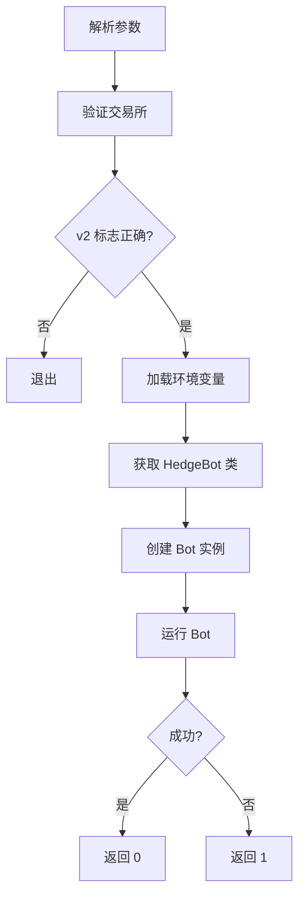
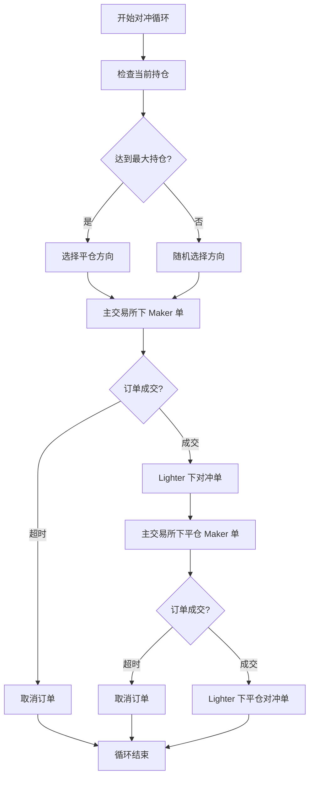
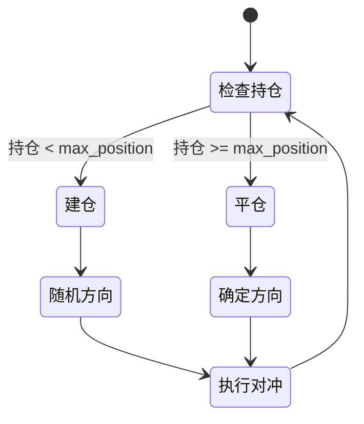

# 对冲模式模块

## 模块概述

对冲模式模块实现了跨交易所的对冲交易策略。通过在主交易所下 maker 订单,同时在 Lighter 交易所下对冲订单,实现风险对冲和双倍交易量。

## 核心概念

### 什么是对冲模式?

对冲模式是一种在两个交易所之间同时进行相反方向交易的策略:

1. **主交易所**: 下 maker 限价单 (如 Backpack, Extended, GRVT 等)
2. **对冲交易所**: Lighter 交易所,下市价单进行即时对冲

通过持有相反头寸,降低单边市场风险,同时在两个交易所产生交易量。

### 对冲模式优势

- ✅ **风险降低**: 相反头寸相互抵消市场风险
- ✅ **双倍交易量**: 同时在两个交易所产生交易量
- ✅ **套利机会**: 利用交易所间价差获利
- ✅ **全自动化**: 无需人工干预

### 对冲模式风险

- ⚠️ **手续费成本**: 两个交易所的手续费
- ⚠️ **滑点**: 市价单可能产生滑点
- ⚠️ **价差风险**: 两个交易所价格可能不一致
- ⚠️ **执行风险**: 对冲单可能未及时成交

## 核心文件

### 1. `hedge_mode.py`

对冲模式的统一入口文件,负责路由到具体的交易所实现。

#### 1.1 主要功能

**`parse_arguments()`**

解析对冲模式参数:

```python
parser.add_argument('--exchange', required=True,
                    help='主交易所 (backpack, extended, apex, grvt, edgex, nado)')
parser.add_argument('--ticker', default='BTC',
                    help='交易对符号')
parser.add_argument('--size', required=True,
                    help='每笔订单数量')
parser.add_argument('--iter', required=True, type=int,
                    help='交易循环次数')
parser.add_argument('--fill-timeout', default=5, type=int,
                    help='Maker 订单等待成交超时时间')
parser.add_argument('--sleep', default=0, type=int,
                    help='每笔交易后暂停时间')
parser.add_argument('--max-position', type=Decimal, default=Decimal('0'),
                    help='最大持仓量')
parser.add_argument('--v2', action='store_true',
                    help='使用 v2 实现 (仅 GRVT 支持)')
```

**`get_hedge_bot_class(exchange, v2=False)`**

根据交易所名称动态导入对应的 HedgeBot 类:

```python
def get_hedge_bot_class(exchange, v2=False):
    if exchange.lower() == 'backpack':
        from hedge.hedge_mode_bp import HedgeBot
        return HedgeBot
    elif exchange.lower() == 'extended':
        from hedge.hedge_mode_ext import HedgeBot
        return HedgeBot
    elif exchange.lower() == 'grvt':
        if v2:
            from hedge.hedge_mode_grvt_v2 import HedgeBot
        else:
            from hedge.hedge_mode_grvt import HedgeBot
        return HedgeBot
    # ... 其他交易所
```

**优势**:
- **懒加载**: 只导入需要的交易所模块
- **跨平台**: 直接导入而非子进程调用
- **统一接口**: 所有交易所使用相同的入口

#### 1.2 主流程



### 2. `hedge/hedge_mode_bp.py`

Backpack + Lighter 对冲模式实现。

#### 2.1 HedgeBot 类

##### 初始化

```python
class HedgeBot:
    def __init__(
        self,
        ticker: str,
        order_quantity: Decimal,
        fill_timeout: int = 5,
        iterations: int = 10,
        sleep_time: int = 0,
        max_position: Decimal = Decimal('0')
    ):
        self.ticker = ticker
        self.order_quantity = order_quantity
        self.fill_timeout = fill_timeout
        self.iterations = iterations
        self.sleep_time = sleep_time
        self.max_position = max_position
        
        # 创建主交易所客户端
        self.main_client = BackpackClient(config)
        
        # 创建对冲交易所客户端
        self.hedge_client = LighterClient(config)
```

##### 核心交易流程

**`run(self)` - 主循环**

```python
async def run(self):
    """运行对冲交易"""
    try:
        # 1. 连接到两个交易所
        await self.main_client.connect()
        await self.hedge_client.connect()
        
        # 2. 获取合约信息
        main_contract_id, _ = await self.main_client.get_contract_attributes()
        hedge_contract_id, _ = await self.hedge_client.get_contract_attributes()
        
        # 3. 执行交易循环
        for i in range(self.iterations):
            await self._execute_hedge_cycle()
            
            if self.sleep_time > 0:
                await asyncio.sleep(self.sleep_time)
        
        # 4. 关闭连接
        await self.main_client.disconnect()
        await self.hedge_client.disconnect()
        
    except Exception as e:
        logger.error(f"对冲交易失败: {e}")
        raise
```

**`_execute_hedge_cycle(self)` - 单次对冲循环**



**详细步骤**:

1. **检查持仓**:
   ```python
   main_position = await self.main_client.get_account_positions()
   
   # 根据 max_position 决定方向
   if abs(main_position) >= self.max_position:
       # 需要平仓
       direction = 'sell' if main_position > 0 else 'buy'
   else:
       # 随机方向
       direction = random.choice(['buy', 'sell'])
   ```

2. **主交易所开仓**:
   ```python
   # 下 maker 限价单
   open_order = await self.main_client.place_open_order(
       contract_id=main_contract_id,
       quantity=self.order_quantity,
       direction=direction
   )
   
   # 等待成交或超时
   start_time = time.time()
   while time.time() - start_time < self.fill_timeout:
       order_info = await self.main_client.get_order_info(open_order.order_id)
       if order_info.status == 'FILLED':
           break
       await asyncio.sleep(0.5)
   
   # 超时则取消
   if order_info.status != 'FILLED':
       await self.main_client.cancel_order(open_order.order_id)
       return
   ```

3. **Lighter 对冲开仓**:
   ```python
   # 对冲方向相反
   hedge_direction = 'sell' if direction == 'buy' else 'buy'
   
   # 下市价单立即成交
   hedge_order = await self.hedge_client.place_market_order(
       contract_id=hedge_contract_id,
       quantity=self.order_quantity,
       side=hedge_direction
   )
   ```

4. **主交易所平仓**:
   ```python
   # 计算平仓价格 (小幅盈利)
   if direction == 'buy':
       close_price = open_order.price * Decimal('1.0002')
   else:
       close_price = open_order.price * Decimal('0.9998')
   
   # 下限价平仓单
   close_order = await self.main_client.place_close_order(
       contract_id=main_contract_id,
       quantity=self.order_quantity,
       price=close_price,
       side=hedge_direction
   )
   
   # 等待成交
   # ... (同开仓逻辑)
   ```

5. **Lighter 对冲平仓**:
   ```python
   # 下市价单平仓
   hedge_close = await self.hedge_client.place_market_order(
       contract_id=hedge_contract_id,
       quantity=self.order_quantity,
       side=direction  # 与开仓方向相同
   )
   ```

### 3. 其他交易所实现

#### 3.1 Extended (`hedge/hedge_mode_ext.py`)

Extended + Lighter 对冲模式。

**特点**:
- Stark Key 签名
- Vault 系统
- 类似 Backpack 的流程

#### 3.2 GRVT (`hedge/hedge_mode_grvt.py` 和 `hedge_mode_grvt_v2.py`)

GRVT + Lighter 对冲模式,提供两个版本。

**v1 特点**:
- 固定迭代次数
- 基础对冲逻辑
- 支持 max_position

**v2 特点**:
- 更智能的持仓管理
- 改进的风险控制
- 优化的订单执行

**v2 示例**:
```python
class HedgeBot:
    def __init__(
        self,
        ticker: str,
        order_quantity: Decimal,
        fill_timeout: int = 5,
        max_position: Decimal = Decimal('0')
    ):
        # v2 不需要 iterations 参数
        # 持续运行直到手动停止
        pass
    
    async def run(self):
        """v2 持续运行模式"""
        while True:
            try:
                await self._execute_hedge_cycle()
                
                # 检查是否需要停止
                if self._should_stop():
                    break
                    
            except KeyboardInterrupt:
                break
            except Exception as e:
                logger.error(f"Error: {e}")
                await asyncio.sleep(5)
```

#### 3.3 Apex (`hedge/hedge_mode_apex.py`)

Apex + Lighter 对冲模式。

**特点**:
- Omni Key Seed 认证
- API Key + Passphrase
- 支持多合约

#### 3.4 EdgeX (`hedge/hedge_mode_edgex.py`)

EdgeX + Lighter 对冲模式。

**特点**:
- Starknet L2
- 高性能订单簿
- 低手续费

#### 3.5 Nado (`hedge/hedge_mode_nado.py`)

Nado + Lighter 对冲模式。

**特点**:
- Solana 生态
- 直接钱包签名
- 支持主网/测试网

## Max Position 机制

### 概念

`max_position` 参数用于控制最大持仓量,实现逐步建仓和平仓的循环。

### 工作原理



### 代码实现

```python
async def _determine_direction(self):
    """确定交易方向"""
    position = await self.main_client.get_account_positions()
    
    if self.max_position == 0:
        # 无持仓限制,随机方向
        return random.choice(['buy', 'sell'])
    
    if abs(position) >= self.max_position:
        # 达到最大持仓,需要平仓
        if position > 0:
            return 'sell'  # 多仓,卖出平仓
        else:
            return 'buy'   # 空仓,买入平仓
    else:
        # 未达到最大持仓,随机建仓
        return random.choice(['buy', 'sell'])
```

### 使用示例

```bash
# 设置最大持仓 0.1 BTC
python hedge_mode.py \
  --exchange grvt \
  --ticker BTC \
  --size 0.01 \
  --iter 100 \
  --max-position 0.1
```

**效果**:
- 初始持仓 0 → 随机买入/卖出 → 逐步建仓
- 持仓达到 0.1 BTC → 强制卖出 → 逐步平仓
- 持仓回到 0 → 再次随机建仓
- 如此循环往复

## 使用示例

### 基础对冲

```bash
# Backpack + Lighter 对冲
python hedge_mode.py \
  --exchange backpack \
  --ticker BTC \
  --size 0.002 \
  --iter 10
```

### 带超时控制

```bash
# 设置 maker 单 10 秒超时
python hedge_mode.py \
  --exchange extended \
  --ticker ETH \
  --size 0.1 \
  --iter 20 \
  --fill-timeout 10
```

### 带暂停时间

```bash
# 每次对冲后暂停 30 秒
python hedge_mode.py \
  --exchange apex \
  --ticker BTC \
  --size 0.05 \
  --iter 50 \
  --sleep 30
```

### 带最大持仓

```bash
# 限制最大持仓 0.1 BTC
python hedge_mode.py \
  --exchange grvt \
  --ticker BTC \
  --size 0.01 \
  --iter 100 \
  --max-position 0.1
```

### GRVT v2 模式

```bash
# 使用 GRVT v2 实现
python hedge_mode.py \
  --exchange grvt \
  --v2 \
  --ticker BTC \
  --size 0.05 \
  --max-position 0.2
```

## 成本分析

### 手续费计算

假设:
- 主交易所 maker 费率: -0.02% (返佣)
- Lighter taker 费率: 0.05%
- 单次对冲数量: 0.1 ETH
- ETH 价格: $3000

**单次完整对冲成本**:

1. **主交易所开仓**: 0.1 ETH × $3000 × (-0.02%) = -$0.06 (返佣)
2. **Lighter 对冲开仓**: 0.1 ETH × $3000 × 0.05% = $0.15
3. **主交易所平仓**: 0.1 ETH × $3000 × (-0.02%) = -$0.06 (返佣)
4. **Lighter 对冲平仓**: 0.1 ETH × $3000 × 0.05% = $0.15

**总成本**: $0.15 + $0.15 - $0.06 - $0.06 = **$0.18**

**交易量**: 0.1 × $3000 × 4 = **$1200**

**成本率**: $0.18 / $1200 = **0.015%**

### 盈利来源

1. **手续费返佣**: 主交易所 maker 返佣
2. **推荐返佣**: 通过推荐链接获得额外返佣
3. **积分奖励**: 参与交易竞赛获得积分
4. **价差套利**: 两个交易所价格差异

### 风险成本

1. **滑点**: Lighter 市价单可能产生滑点
2. **价差**: 两个交易所价格可能不一致
3. **执行失败**: 对冲单可能未及时成交

## 最佳实践

### 1. 参数设置

```bash
# 保守型: 小仓位, 长超时
--size 0.01 --fill-timeout 10 --sleep 60

# 稳健型: 中等仓位, 中等超时
--size 0.05 --fill-timeout 5 --sleep 30

# 激进型: 大仓位, 短超时
--size 0.1 --fill-timeout 3 --sleep 0
```

### 2. 错误处理

```python
async def _execute_hedge_cycle(self):
    try:
        # 执行对冲逻辑
        await self._hedge_logic()
    except OrderNotFilled:
        logger.warning("订单未成交,取消并重试")
        # 清理未成交订单
        await self._cleanup_orders()
    except HedgeExecutionError:
        logger.error("对冲执行失败,等待后重试")
        await asyncio.sleep(5)
    except Exception as e:
        logger.error(f"未知错误: {e}")
        raise
```

### 3. 持仓监控

```python
async def _check_position_sync(self):
    """检查两个交易所持仓是否同步"""
    main_pos = await self.main_client.get_account_positions()
    hedge_pos = await self.hedge_client.get_account_positions()
    
    # 持仓应该相反
    expected_hedge = -main_pos
    diff = abs(hedge_pos - expected_hedge)
    
    if diff > self.order_quantity * 2:
        logger.error(f"持仓不同步! Main: {main_pos}, Hedge: {hedge_pos}")
        # 发送通知
        await self._send_alert(f"Position mismatch: {main_pos} vs {hedge_pos}")
```

### 4. 日志记录

```python
async def _log_trade(self, trade_type, direction, quantity, price):
    """记录交易"""
    self.logger.log_transaction(
        order_id=f"{trade_type}_{int(time.time())}",
        side=direction,
        size=quantity,
        price=price,
        status='FILLED'
    )
```

## 性能优化

### 1. 并发执行

```python
# 同时下两个交易所的订单
async def _parallel_hedge(self):
    main_task = self.main_client.place_open_order(...)
    hedge_task = self.hedge_client.place_market_order(...)
    
    # 等待两个订单都完成
    main_result, hedge_result = await asyncio.gather(
        main_task, 
        hedge_task
    )
```

### 2. 预获取价格

```python
# 在下单前获取价格,减少延迟
best_bid, best_ask = await self.main_client.fetch_bbo_prices(contract_id)
```

### 3. 连接复用

```python
# 保持 WebSocket 连接,避免频繁重连
await self.main_client.connect()
await self.hedge_client.connect()

# 执行多次对冲
for _ in range(iterations):
    await self._execute_hedge_cycle()

# 最后再断开
await self.main_client.disconnect()
await self.hedge_client.disconnect()
```

## 交易所支持对比

| 主交易所 | 对冲交易所 | 文件 | max_position | v2 支持 |
|---------|-----------|------|--------------|---------|
| Backpack | Lighter | hedge_mode_bp.py | ✅ | ❌ |
| Extended | Lighter | hedge_mode_ext.py | ❌ | ❌ |
| Apex | Lighter | hedge_mode_apex.py | ❌ | ❌ |
| GRVT | Lighter | hedge_mode_grvt.py | ✅ | ✅ |
| EdgeX | Lighter | hedge_mode_edgex.py | ✅ | ❌ |
| Nado | Lighter | hedge_mode_nado.py | ✅ | ❌ |

## 故障排查

### 订单未成交

**症状**: Maker 单长时间未成交

**解决方案**:
1. 增加 `--fill-timeout` 时间
2. 调整下单价格,更接近市价
3. 检查市场流动性

### 持仓不同步

**症状**: 两个交易所持仓不一致

**解决方案**:
1. 暂停机器人
2. 手动检查两个交易所持仓
3. 手动平衡持仓
4. 重启机器人

### Lighter 连接失败

**症状**: 无法连接到 Lighter 交易所

**解决方案**:
1. 检查 API 密钥配置
2. 验证账户索引正确性
3. 检查网络连接
4. 查看 Lighter 服务状态

## 未来改进

1. **智能价差检测**: 只在价差有利时执行对冲
2. **动态手续费优化**: 根据手续费调整策略
3. **多交易所对冲**: 支持更多对冲交易所
4. **风险预警**: 实时监控风险指标
5. **自动再平衡**: 自动修复持仓不同步
