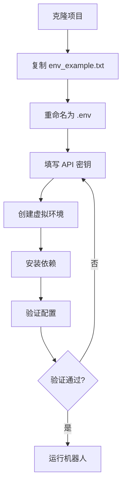
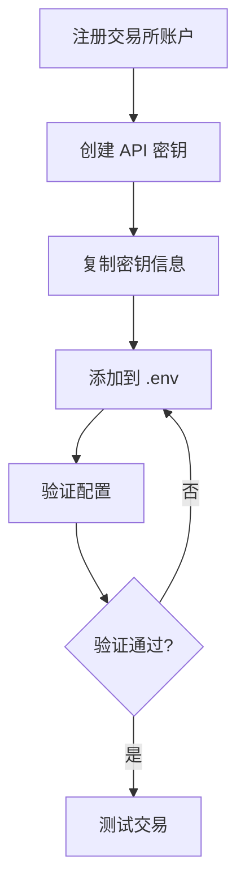

# 配置管理模块

## 模块概述

配置管理模块负责处理环境变量、API 密钥、交易参数等配置信息的加载和验证。

## 核心文件

### 1. `.env` - 环境变量配置文件

项目使用 `.env` 文件管理敏感配置信息,如 API 密钥、私钥等。

#### 1.1 文件结构

```bash
# .env 文件示例

# ==================== 通用配置 ====================
ACCOUNT_NAME=MAIN                    # 账户名称,用于多账户区分

# ==================== Telegram 配置 (可选) ====================
TELEGRAM_BOT_TOKEN=123456789:ABCdefGHIjklMNOpqrsTUVwxyz
TELEGRAM_CHAT_ID=987654321

# ==================== 飞书配置 (可选) ====================
LARK_TOKEN=https://open.feishu.cn/open-apis/bot/v2/hook/xxxxxxxx

# ==================== EdgeX 配置 ====================
EDGEX_ACCOUNT_ID=0x1234567890abcdef
EDGEX_STARK_PRIVATE_KEY=0xabcdef1234567890
EDGEX_BASE_URL=https://pro.edgex.exchange
EDGEX_WS_URL=wss://quote.edgex.exchange

# ==================== Backpack 配置 ====================
BACKPACK_PUBLIC_KEY=your_public_key
BACKPACK_SECRET_KEY=your_secret_key

# ==================== Paradex 配置 ====================
PARADEX_L1_ADDRESS=0x1234567890abcdef
PARADEX_L2_PRIVATE_KEY=0xabcdef1234567890

# ==================== Aster 配置 ====================
ASTER_API_KEY=your_api_key
ASTER_SECRET_KEY=your_secret_key

# ==================== Lighter 配置 ====================
API_KEY_PRIVATE_KEY=0xabcdef1234567890
LIGHTER_ACCOUNT_INDEX=12345
LIGHTER_API_KEY_INDEX=1

# ==================== GRVT 配置 ====================
GRVT_TRADING_ACCOUNT_ID=your_trading_account_id
GRVT_PRIVATE_KEY=0xabcdef1234567890
GRVT_API_KEY=your_api_key

# ==================== Extended 配置 ====================
EXTENDED_API_KEY=your_api_key
EXTENDED_STARK_KEY_PUBLIC=0x1234567890abcdef
EXTENDED_STARK_KEY_PRIVATE=0xabcdef1234567890
EXTENDED_VAULT=12345

# ==================== Apex 配置 ====================
APEX_API_KEY=your_api_key
APEX_API_KEY_PASSPHRASE=your_passphrase
APEX_API_KEY_SECRET=your_secret
APEX_OMNI_KEY_SEED=your_seed

# ==================== Nado 配置 ====================
NADO_PRIVATE_KEY=your_wallet_private_key
NADO_MODE=MAINNET    # MAINNET 或 DEVNET
```

#### 1.2 配置加载

使用 `python-dotenv` 库加载环境变量:

```python
import dotenv
from pathlib import Path

# 加载默认 .env 文件
dotenv.load_dotenv()

# 加载指定 .env 文件
dotenv.load_dotenv('.env.account1')
```

### 2. `env_example.txt` - 配置模板

提供配置文件模板,供用户复制并填写自己的密钥。

#### 2.1 使用方法

```bash
# 1. 复制模板
cp env_example.txt .env

# 2. 编辑 .env 文件,填写你的 API 密钥
nano .env

# 3. 验证配置
python -c "import dotenv; dotenv.load_dotenv(); import os; print('Config loaded!')"
```

### 3. 多账户配置

支持在同一设备上运行多个账户。

#### 3.1 配置多个账户

```bash
# 创建多个 .env 文件
.env.account1
.env.account2
.env.account3
```

**account1.env 示例**:
```bash
ACCOUNT_NAME=ACCOUNT1
EDGEX_ACCOUNT_ID=0x1111111111111111
EDGEX_STARK_PRIVATE_KEY=0xaaaaaaaaaaaaaaaa
```

**account2.env 示例**:
```bash
ACCOUNT_NAME=ACCOUNT2
EDGEX_ACCOUNT_ID=0x2222222222222222
EDGEX_STARK_PRIVATE_KEY=0xbbbbbbbbbbbbbbbb
```

#### 3.2 使用不同账户

```bash
# 使用账户 1
python runbot.py --env-file .env.account1 --exchange edgex --ticker ETH

# 使用账户 2
python runbot.py --env-file .env.account2 --exchange edgex --ticker BTC
```

#### 3.3 多账户日志分离

通过 `ACCOUNT_NAME` 环境变量区分不同账户的日志:

```python
account_name = os.getenv("ACCOUNT_NAME", "")
log_message = f"[{account_name}] {message}" if account_name else message
```

**日志输出**:
```
[ACCOUNT1] Order placed: 12345
[ACCOUNT2] Order filled: 67890
```

## 配置验证

### 1. 交易所配置验证

每个交易所客户端都实现了 `_validate_config()` 方法:

```python
class EdgeXClient(BaseExchangeClient):
    def _validate_config(self):
        """验证 EdgeX 配置"""
        required_vars = [
            'EDGEX_ACCOUNT_ID',
            'EDGEX_STARK_PRIVATE_KEY'
        ]
        
        for var in required_vars:
            value = os.getenv(var)
            if not value:
                raise ValueError(f"Missing required environment variable: {var}")
```

### 2. 参数验证

在 `runbot.py` 中验证命令行参数:

```python
def validate_arguments(args):
    """验证命令行参数"""
    # 验证 Boost 模式
    if args.boost and args.exchange not in ['aster', 'backpack']:
        raise ValueError("--boost only supported for aster and backpack")
    
    # 验证数量大于 0
    if args.quantity <= 0:
        raise ValueError("--quantity must be positive")
    
    # 验证止盈大于 0
    if args.take_profit < 0:
        raise ValueError("--take-profit must be non-negative")
```

### 3. 配置检查脚本

创建配置检查工具:

```python
# check_config.py
import os
import dotenv

def check_exchange_config(exchange):
    """检查交易所配置"""
    configs = {
        'edgex': ['EDGEX_ACCOUNT_ID', 'EDGEX_STARK_PRIVATE_KEY'],
        'backpack': ['BACKPACK_PUBLIC_KEY', 'BACKPACK_SECRET_KEY'],
        'grvt': ['GRVT_TRADING_ACCOUNT_ID', 'GRVT_PRIVATE_KEY', 'GRVT_API_KEY'],
        # ... 其他交易所
    }
    
    if exchange not in configs:
        print(f"❌ Unknown exchange: {exchange}")
        return False
    
    missing = []
    for var in configs[exchange]:
        if not os.getenv(var):
            missing.append(var)
    
    if missing:
        print(f"❌ Missing config for {exchange}:")
        for var in missing:
            print(f"  - {var}")
        return False
    
    print(f"✅ {exchange} config is valid")
    return True

# 使用
dotenv.load_dotenv()
check_exchange_config('edgex')
```

## 配置最佳实践

### 1. 安全性

**不要提交 `.env` 文件到 Git**:

```bash
# .gitignore
.env
.env.*
!env_example.txt
```

**使用强密码和随机私钥**:
```bash
# 生成随机私钥 (示例,实际使用交易所提供的)
openssl rand -hex 32
```

**定期轮换 API 密钥**:
- 每月更换一次 API 密钥
- 记录密钥更换日期
- 立即删除旧密钥

### 2. 备份

**备份配置文件**:
```bash
# 加密备份
tar czf config_backup.tar.gz .env* | gpg --symmetric --cipher-algo AES256

# 恢复
gpg --decrypt config_backup.tar.gz.gpg | tar xz
```

### 3. 权限管理

**设置文件权限** (Linux/Mac):
```bash
# 只有所有者可读写
chmod 600 .env
```

### 4. 环境隔离

**开发/生产环境分离**:

```bash
# 开发环境
.env.dev

# 生产环境
.env.prod

# 测试环境
.env.test
```

**使用环境变量切换**:
```python
env = os.getenv('ENVIRONMENT', 'dev')
dotenv.load_dotenv(f'.env.{env}')
```

## 依赖配置

### 1. `requirements.txt` - 通用依赖

```txt
python-dotenv==1.0.0
aiohttp==3.9.1
websockets==12.0
tenacity==8.2.3
requests==2.31.0
```

**安装**:
```bash
pip install -r requirements.txt
```

### 2. `para_requirements.txt` - Paradex 专用

```txt
-r requirements.txt
paradex-py==0.1.8
```

**特殊要求**:
- Python 3.9 - 3.12

**安装**:
```bash
# 创建专用虚拟环境
python3 -m venv para_env
source para_env/bin/activate
pip install -r para_requirements.txt
```

### 3. `apex_requirements.txt` - Apex 专用

```txt
-r requirements.txt
apex-sdk==1.2.3
```

**安装**:
```bash
pip install -r apex_requirements.txt
```

### 4. GRVT SDK

```bash
# GRVT 需要单独安装
pip install grvt-pysdk
```

**要求**:
- Python 3.10+

## 配置工作流

### 1. 首次设置



**命令序列**:
```bash
# 1. 克隆项目
git clone <repo-url>
cd perp-dex-tools

# 2. 设置配置
cp env_example.txt .env
nano .env  # 填写你的密钥

# 3. 创建虚拟环境
python3 -m venv env
source env/bin/activate  # Windows: env\Scripts\activate

# 4. 安装依赖
pip install -r requirements.txt

# 5. 验证
python -c "import dotenv; dotenv.load_dotenv(); print('✅ Config loaded')"

# 6. 运行
python runbot.py --exchange edgex --ticker ETH
```

### 2. 添加新交易所



### 3. 多账户设置

```bash
# 1. 创建第一个账户配置
cp .env .env.account1
# 编辑 .env.account1,设置 ACCOUNT_NAME=ACCOUNT1

# 2. 创建第二个账户配置
cp .env .env.account2
# 编辑 .env.account2,设置 ACCOUNT_NAME=ACCOUNT2

# 3. 分别运行
python runbot.py --env-file .env.account1 --exchange edgex --ticker ETH &
python runbot.py --env-file .env.account2 --exchange backpack --ticker BTC &
```

## 配置问题排查

### 1. 环境变量未加载

**症状**: `Missing required environment variable` 错误

**解决方案**:
```python
# 检查 .env 文件是否存在
import os
from pathlib import Path

env_file = Path('.env')
if not env_file.exists():
    print("❌ .env file not found!")
else:
    print("✅ .env file exists")

# 检查环境变量是否加载
import dotenv
dotenv.load_dotenv()

api_key = os.getenv('EDGEX_ACCOUNT_ID')
if api_key:
    print(f"✅ Loaded: {api_key[:10]}...")
else:
    print("❌ Failed to load EDGEX_ACCOUNT_ID")
```

### 2. API 密钥无效

**症状**: `Authentication failed` 或 `Invalid API key`

**解决方案**:
1. 检查密钥是否复制完整
2. 检查是否有多余的空格或换行
3. 重新生成 API 密钥
4. 验证 IP 白名单 (如果交易所要求)

### 3. Python 版本不兼容

**症状**: 导入模块失败

**解决方案**:
```bash
# 检查 Python 版本
python --version

# Paradex 要求 3.9-3.12
# GRVT 要求 3.10+

# 安装特定版本
pyenv install 3.10.12
pyenv local 3.10.12
```

### 4. 依赖冲突

**症状**: 模块导入错误

**解决方案**:
```bash
# 清理环境
deactivate
rm -rf env/

# 重新创建
python3 -m venv env
source env/bin/activate
pip install --upgrade pip
pip install -r requirements.txt
```

## 配置示例集

### 示例 1: EdgeX 单交易对

```bash
# .env
ACCOUNT_NAME=EdgeX_ETH
EDGEX_ACCOUNT_ID=0x1234567890abcdef
EDGEX_STARK_PRIVATE_KEY=0xabcdef1234567890
```

```bash
# 运行
python runbot.py \
  --exchange edgex \
  --ticker ETH \
  --quantity 0.1 \
  --take-profit 0.02
```

### 示例 2: 多交易所多账户

```bash
# .env.edgex
ACCOUNT_NAME=EdgeX
EDGEX_ACCOUNT_ID=0x1111
EDGEX_STARK_PRIVATE_KEY=0xaaaa
LIGHTER_ACCOUNT_INDEX=12345
API_KEY_PRIVATE_KEY=0xbbbb

# .env.backpack
ACCOUNT_NAME=Backpack
BACKPACK_PUBLIC_KEY=pubkey123
BACKPACK_SECRET_KEY=secret456
LIGHTER_ACCOUNT_INDEX=12345
API_KEY_PRIVATE_KEY=0xbbbb
```

```bash
# 运行多个实例
python runbot.py --env-file .env.edgex --exchange edgex --ticker ETH &
python runbot.py --env-file .env.backpack --exchange backpack --ticker BTC &
```

### 示例 3: 对冲模式完整配置

```bash
# .env
ACCOUNT_NAME=Hedge_Bot

# 主交易所 (GRVT)
GRVT_TRADING_ACCOUNT_ID=account123
GRVT_PRIVATE_KEY=0x1234
GRVT_API_KEY=apikey456

# 对冲交易所 (Lighter)
LIGHTER_ACCOUNT_INDEX=12345
LIGHTER_API_KEY_INDEX=1
API_KEY_PRIVATE_KEY=0x5678

# 通知
TELEGRAM_BOT_TOKEN=123:ABC
TELEGRAM_CHAT_ID=987654321
```

```bash
# 运行对冲模式
python hedge_mode.py \
  --exchange grvt \
  --ticker BTC \
  --size 0.01 \
  --iter 100 \
  --max-position 0.1
```

## 安全检查清单

- [ ] `.env` 文件在 `.gitignore` 中
- [ ] 文件权限设置为 600 (仅所有者可读写)
- [ ] 定期轮换 API 密钥
- [ ] 备份配置文件并加密
- [ ] 使用强密码和随机私钥
- [ ] 限制 API 密钥权限 (只授予必要权限)
- [ ] 设置 IP 白名单 (如果支持)
- [ ] 不在公共网络使用
- [ ] 监控异常 API 调用
- [ ] 保持依赖库最新

## 配置维护

### 定期任务

**每周**:
- 检查日志文件大小
- 验证 API 密钥有效性
- 清理旧日志

**每月**:
- 轮换 API 密钥
- 备份配置文件
- 更新依赖库

**每季度**:
- 审查安全设置
- 更新文档
- 测试灾难恢复流程

### 自动化脚本

```bash
# maintenance.sh
#!/bin/bash

# 备份配置
backup_config() {
    timestamp=$(date +%Y%m%d_%H%M%S)
    tar czf "backup_${timestamp}.tar.gz" .env*
    echo "✅ Config backed up"
}

# 清理日志
cleanup_logs() {
    find logs/ -name "*.log" -mtime +30 -delete
    find logs/ -name "*.csv" -mtime +30 -delete
    echo "✅ Old logs cleaned"
}

# 检查依赖
check_dependencies() {
    pip list --outdated
}

# 执行
backup_config
cleanup_logs
check_dependencies
```
