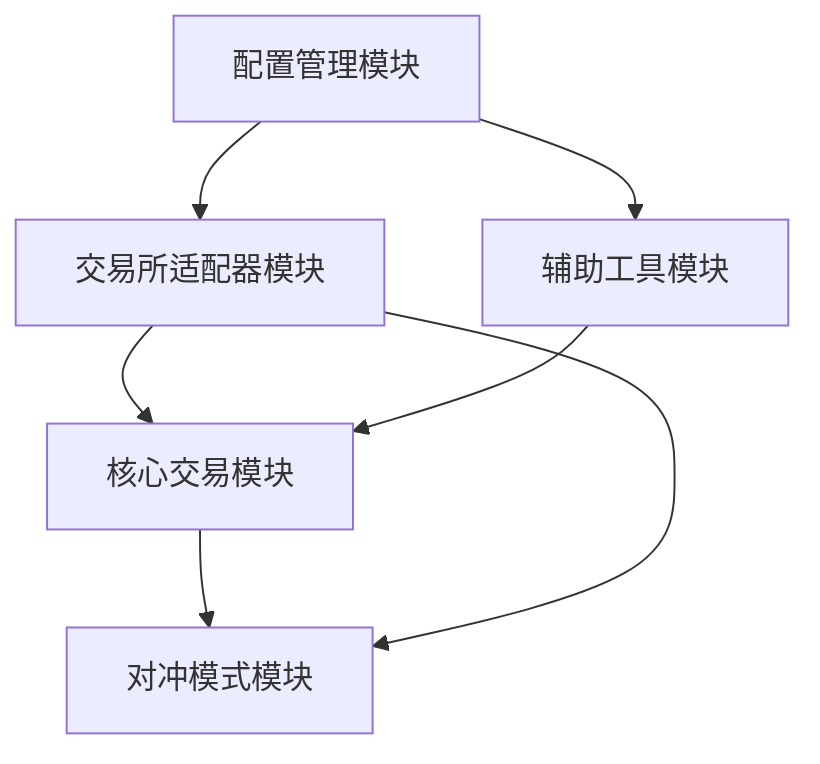

# 模块索引

本目录包含项目各个功能模块的详细分析文档。

## 📚 模块列表

### [01 - 核心交易模块](./01-核心交易模块.md)

**核心组件**: `trading_bot.py`, `runbot.py`

**主要功能**:
- 自动化交易策略实现
- 订单管理与监控
- 风险控制机制
- WebSocket 实时数据处理
- 异步事件驱动架构

**关键类**:
- `TradingBot`: 主交易机器人
- `TradingConfig`: 交易配置
- `OrderMonitor`: 订单监控

**适合阅读对象**: 想要了解核心交易逻辑的开发者

---

### [02 - 交易所适配器模块](./02-交易所适配器模块.md)

**核心组件**: `exchanges/` 目录

**主要功能**:
- 抽象基类设计
- 工厂模式实现
- 9 个交易所客户端
- 统一接口封装
- 重试机制与错误处理

**支持的交易所**:
- EdgeX, Backpack, Paradex
- Aster, Lighter, GRVT
- Extended, Apex, Nado

**适合阅读对象**: 想要添加新交易所或理解交易所对接的开发者

---

### [03 - 对冲模式模块](./03-对冲模式模块.md)

**核心组件**: `hedge_mode.py`, `hedge/` 目录

**主要功能**:
- 跨交易所对冲策略
- 主交易所 + Lighter 对冲
- Max Position 机制
- 自动化风险管理
- 双倍交易量生成

**支持的主交易所**:
- Backpack, Extended, Apex
- GRVT (v1/v2), EdgeX, Nado

**适合阅读对象**: 想要使用对冲模式降低风险的交易者

---

### [04 - 辅助工具模块](./04-辅助工具模块.md)

**核心组件**: `helpers/` 目录

**主要功能**:
- 日志记录系统 (`TradingLogger`)
- Telegram 通知 (`TelegramBot`)
- 飞书通知 (`LarkBot`)
- 交易记录 CSV 导出
- 实时状态监控

**功能特点**:
- 彩色控制台输出
- 结构化日志存储
- 多渠道通知支持
- 异步消息发送

**适合阅读对象**: 想要了解日志和通知系统的开发者

---

### [05 - 配置管理模块](./05-配置管理模块.md)

**核心组件**: `.env`, 环境变量管理

**主要功能**:
- 环境变量配置
- API 密钥管理
- 多账户支持
- 配置验证
- 依赖管理

**配置文件**:
- `.env`: 主配置文件
- `requirements.txt`: 通用依赖
- `para_requirements.txt`: Paradex 专用
- `apex_requirements.txt`: Apex 专用

**适合阅读对象**: 新用户和需要配置多账户的用户

---

## 🗺️ 模块依赖关系



**说明**:
1. **配置管理模块**: 为所有模块提供配置信息
2. **交易所适配器模块**: 提供与交易所交互的接口
3. **辅助工具模块**: 提供日志和通知服务
4. **核心交易模块**: 实现主要交易逻辑
5. **对冲模式模块**: 基于核心模块实现对冲策略

## 📖 阅读建议

### 新手用户

**推荐阅读顺序**:
1. [配置管理模块](./05-配置管理模块.md) - 了解如何配置项目
2. [核心交易模块](./01-核心交易模块.md) - 理解基本交易逻辑
3. [辅助工具模块](./04-辅助工具模块.md) - 掌握日志和通知
4. [对冲模式模块](./03-对冲模式模块.md) - 学习高级策略

### 开发者

**推荐阅读顺序**:
1. [交易所适配器模块](./02-交易所适配器模块.md) - 理解架构设计
2. [核心交易模块](./01-核心交易模块.md) - 深入交易逻辑
3. [对冲模式模块](./03-对冲模式模块.md) - 学习对冲实现
4. [辅助工具模块](./04-辅助工具模块.md) - 了解辅助功能
5. [配置管理模块](./05-配置管理模块.md) - 掌握配置细节

### 交易者

**推荐阅读顺序**:
1. [配置管理模块](./05-配置管理模块.md) - 快速上手
2. [核心交易模块](./01-核心交易模块.md) - 理解策略原理
3. [对冲模式模块](./03-对冲模式模块.md) - 学习对冲策略
4. [辅助工具模块](./04-辅助工具模块.md) - 监控与通知

## 🔍 快速查找

### 按功能查找

| 功能 | 模块 | 文件 |
|------|------|------|
| 下单逻辑 | 核心交易模块 | `trading_bot.py` |
| 订单监控 | 核心交易模块 | `trading_bot.py` |
| 风险控制 | 核心交易模块 | `trading_bot.py` |
| 交易所对接 | 交易所适配器模块 | `exchanges/*.py` |
| 添加新交易所 | 交易所适配器模块 | `exchanges/factory.py` |
| 对冲交易 | 对冲模式模块 | `hedge_mode.py` |
| 日志记录 | 辅助工具模块 | `helpers/logger.py` |
| 消息通知 | 辅助工具模块 | `helpers/telegram_bot.py` |
| 环境配置 | 配置管理模块 | `.env` |
| 多账户管理 | 配置管理模块 | `.env.*` |

### 按交易所查找

| 交易所 | 标准模式 | 对冲模式 | 配置文档 |
|--------|---------|---------|---------|
| EdgeX | [Module 02](./02-交易所适配器模块.md#1-edgex-exchangesedgexpy) | [Module 03](./03-对冲模式模块.md#34-edgex-hedgehedge_mode_edgexpy) | [Module 05](./05-配置管理模块.md#11-文件结构) |
| Backpack | [Module 02](./02-交易所适配器模块.md#2-backpack-exchangesbackpackpy) | [Module 03](./03-对冲模式模块.md#2-hedgehedge_mode_bppy) | [Module 05](./05-配置管理模块.md#11-文件结构) |
| GRVT | [Module 02](./02-交易所适配器模块.md#6-grvt-exchangesgrvtpy) | [Module 03](./03-对冲模式模块.md#32-grvt-hedgehedge_mode_grvtpy-和-hedge_mode_grvt_v2py) | [Module 05](./05-配置管理模块.md#11-文件结构) |

### 按问题查找

| 问题 | 查看模块 | 章节 |
|------|---------|------|
| 如何配置 API 密钥? | 配置管理模块 | 1.1 文件结构 |
| 如何设置多个账户? | 配置管理模块 | 3. 多账户配置 |
| 订单一直不成交? | 核心交易模块 | 订单管理 |
| 仓位不匹配怎么办? | 核心交易模块 | 监控与日志 |
| 如何添加新交易所? | 交易所适配器模块 | 添加新交易所 |
| 对冲模式如何工作? | 对冲模式模块 | 核心概念 |
| 如何设置通知? | 辅助工具模块 | Telegram/Lark Bot |
| 日志文件在哪里? | 辅助工具模块 | TradingLogger |

## 📊 模块统计

| 模块 | 核心文件数 | 代码行数 (约) | 复杂度 |
|------|-----------|--------------|--------|
| 核心交易模块 | 2 | 750 | ⭐⭐⭐⭐⭐ |
| 交易所适配器模块 | 14 | 3000+ | ⭐⭐⭐⭐ |
| 对冲模式模块 | 8 | 2000+ | ⭐⭐⭐⭐ |
| 辅助工具模块 | 4 | 300 | ⭐⭐ |
| 配置管理模块 | 3 | 100 | ⭐ |

## 🚀 快速开始

### 最小配置运行

1. **配置环境** ([配置管理模块](./05-配置管理模块.md))
   ```bash
   cp env_example.txt .env
   # 编辑 .env,填写 API 密钥
   ```

2. **安装依赖** ([配置管理模块](./05-配置管理模块.md#依赖配置))
   ```bash
   pip install -r requirements.txt
   ```

3. **运行机器人** ([核心交易模块](./01-核心交易模块.md#使用示例))
   ```bash
   python runbot.py --exchange edgex --ticker ETH
   ```

### 使用对冲模式

1. **配置两个交易所** ([配置管理模块](./05-配置管理模块.md#示例-3-对冲模式完整配置))
   - 主交易所 (如 GRVT)
   - Lighter 交易所

2. **运行对冲模式** ([对冲模式模块](./03-对冲模式模块.md#使用示例))
   ```bash
   python hedge_mode.py --exchange grvt --ticker BTC --size 0.01 --iter 100
   ```

## 💡 进阶主题

### 性能优化

- [异步编程最佳实践](./01-核心交易模块.md#关键设计亮点)
- [WebSocket 连接管理](./02-交易所适配器模块.md#websocket-处理)
- [并发执行优化](./03-对冲模式模块.md#性能优化)

### 安全指南

- [API 密钥管理](./05-配置管理模块.md#配置最佳实践)
- [多账户隔离](./05-配置管理模块.md#3-多账户配置)
- [安全检查清单](./05-配置管理模块.md#安全检查清单)

### 故障排查

- [常见问题解决](./05-配置管理模块.md#配置问题排查)
- [日志分析](./04-辅助工具模块.md#日志分析工具)
- [对冲模式故障](./03-对冲模式模块.md#故障排查)

## 🔄 持续更新

本文档会随项目更新而更新。如有问题或建议,请:

1. 查看 [README.md](../../README.md)
2. 提交 Issue 到 GitHub
3. 联系项目维护者

---

**最后更新**: 2023-12-15

**文档版本**: 1.0.0
