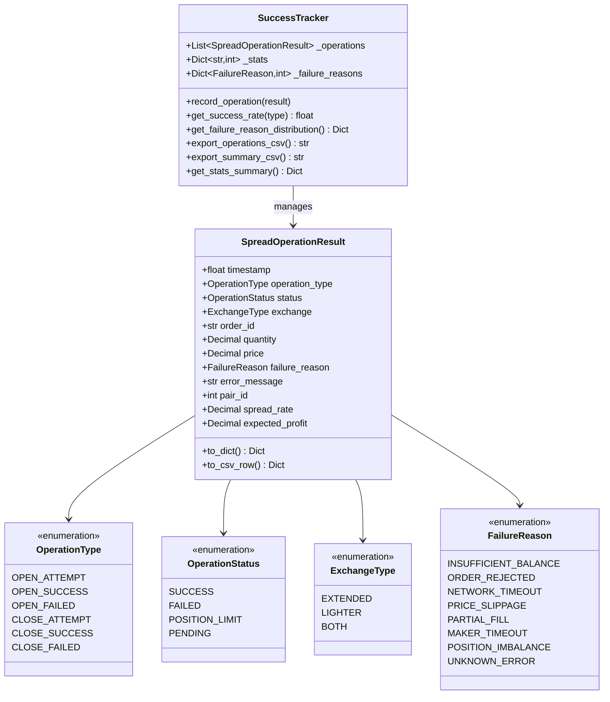
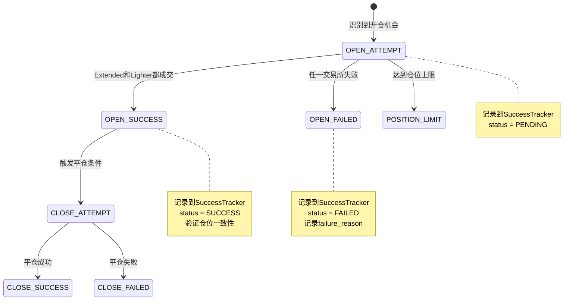

# Data Model: 修复订单类型问题并增加交易成功率统计

**Feature**: 001-fix-order-type
**Date**: 2026-01-11
**Status**: Complete

## Overview

本文档定义了修复订单类型问题和增加成功率统计功能所涉及的数据模型。

## Entities

### 1. SpreadOperationResult (新增)

交易操作结果记录，用于统计开仓/平仓成功率。

**位置**: `spread/success_tracker.py`

```python
@dataclass
class SpreadOperationResult:
    """
    价差套利操作结果记录

    用于追踪开仓/平仓操作的成功率和失败原因
    """
    # 基础信息
    timestamp: float                    # 操作时间戳（Unix时间）
    operation_type: OperationType       # 操作类型（枚举）
    status: OperationStatus             # 操作状态（枚举）
    exchange: ExchangeType              # 涉及的交易所（枚举）

    # 订单信息
    order_id: Optional[str]             # 订单ID（如果成功）
    quantity: Decimal                   # 交易数量
    price: Decimal                      # 交易价格

    # 失败信息
    failure_reason: Optional[FailureReason]  # 失败原因（枚举，如果失败）
    error_message: Optional[str]        # 错误详情（如果有）

    # 上下文信息
    pair_id: Optional[int]              # 关联的套利对ID（如果适用）
    spread_rate: Optional[Decimal]      # 价差率（如果适用）
    expected_profit: Optional[Decimal]  # 期望收益（如果适用）

    def to_dict(self) -> Dict[str, Any]:
        """转换为字典，用于CSV导出"""
        pass

    def to_csv_row(self) -> Dict[str, str]:
        """转换为CSV行，使用双语列名"""
        pass
```

### 2. OperationType (枚举)

操作类型枚举，定义所有可能的交易操作。

```python
class OperationType(Enum):
    """操作类型"""
    OPEN_ATTEMPT = "open_attempt"           # 开仓尝试（识别到机会）
    OPEN_SUCCESS = "open_success"           # 开仓成功
    OPEN_FAILED = "open_failed"             # 开仓失败
    CLOSE_ATTEMPT = "close_attempt"         # 平仓尝试
    CLOSE_SUCCESS = "close_success"         # 平仓成功
    CLOSE_FAILED = "close_failed"           # 平仓失败
```

### 3. OperationStatus (枚举)

操作状态枚举，定义操作的执行结果。

```python
class OperationStatus(Enum):
    """操作状态"""
    SUCCESS = "success"                     # 成功
    FAILED = "failed"                       # 失败
    POSITION_LIMIT = "position_limit"       # 仓位上限（特殊标识）
    PENDING = "pending"                     # 进行中
```

### 4. ExchangeType (枚举)

交易所类型枚举。

```python
class ExchangeType(Enum):
    """交易所类型"""
    EXTENDED = "extended"
    LIGHTER = "lighter"
    BOTH = "both"
```

### 5. FailureReason (枚举)

失败原因枚举，定义所有可能的失败原因。

```python
class FailureReason(Enum):
    """失败原因"""
    INSUFFICIENT_BALANCE = "insufficient_balance"       # 余额不足
    ORDER_REJECTED = "order_rejected"                   # 订单被拒绝
    NETWORK_TIMEOUT = "network_timeout"                 # 网络超时
    PRICE_SLIPPAGE = "price_slippage"                   # 价格滑点过大
    PARTIAL_FILL = "partial_fill"                       # 部分成交
    MAKER_TIMEOUT = "maker_timeout"                     # Maker订单超时
    POSITION_IMBALANCE = "position_imbalance"           # 仓位不一致
    UNKNOWN_ERROR = "unknown_error"                     # 未知错误
```

### 6. SuccessTracker (新增)

成功率追踪器，管理和统计数据。

**位置**: `spread/success_tracker.py`

```python
class SuccessTracker:
    """
    成功率追踪器

    负责记录、统计和导出交易操作的成功率数据
    """

    def __init__(self, output_dir: str = "data"):
        """
        初始化追踪器

        Args:
            output_dir: CSV输出目录
        """
        self.output_dir = Path(output_dir)
        self.output_dir.mkdir(exist_ok=True)

        # 操作记录列表（内存缓存）
        self._operations: List[SpreadOperationResult] = []

        # 统计计数器
        self._stats: Dict[str, int] = {
            'open_attempts': 0,
            'open_successes': 0,
            'open_failed': 0,
            'close_attempts': 0,
            'close_successes': 0,
            'close_failed': 0,
        }

        # 失败原因计数
        self._failure_reasons: Dict[FailureReason, int] = defaultdict(int)

        self.logger = logging.getLogger("SuccessTracker")

    def record_operation(self, result: SpreadOperationResult) -> None:
        """
        记录一次操作结果

        Args:
            result: 操作结果对象
        """
        pass

    def get_success_rate(self, operation_type: OperationType) -> float:
        """
        获取指定操作类型的成功率

        Args:
            operation_type: 操作类型

        Returns:
            成功率（0.0-1.0）
        """
        pass

    def get_failure_reason_distribution(self) -> Dict[FailureReason, int]:
        """
        获取失败原因分布

        Returns:
            失败原因及其出现次数
        """
        pass

    def export_operations_csv(self) -> str:
        """
        导出操作记录到CSV（双语列名）

        Returns:
            导出的文件路径
        """
        pass

    def export_summary_csv(self) -> str:
        """
        导出成功率统计汇总到CSV（双语列名）

        Returns:
            导出的文件路径
        """
        pass

    def get_stats_summary(self) -> Dict[str, Any]:
        """
        获取统计摘要

        Returns:
            包含所有统计数据的字典
        """
        pass
```

## Relationships



## CSV Export Format

### operations_YYYY_MM_DD.csv (操作记录)

双语列名格式：

```csv
timestamp | 时间戳,operation_type | 操作类型,status | 状态,
exchange | 交易所,order_id | 订单ID,quantity | 数量,
price | 价格,failure_reason | 失败原因,error_message | 错误详情,
pair_id | 套利对ID,spread_rate | 价差率,expected_profit | 期望收益
```

### success_stats_YYYY_MM_DD.csv (成功率汇总)

双语列名格式：

```csv
date | 日期,operation_type | 操作类型,total_attempts | 总尝试次数,
success_count | 成功次数,failed_count | 失败次数,success_rate | 成功率,
most_common_failure | 最常见失败原因,failure_count | 失败次数
```

## State Transitions



## Validation Rules

1. **timestamp**: 必须是有效的Unix时间戳（> 0）
2. **quantity**: 必须大于0
3. **price**: 必须大于0
4. **status**: 如果是FAILED，必须有failure_reason
5. **status**: 如果是SUCCESS，必须有order_id

## Data Retention

- **内存缓存**: 最多保留10000条操作记录
- **CSV文件**: 按日期分割，永久保留
- **统计汇总**: 每次导出时重新计算

## Migration Notes

- **新增模块**: `spread/success_tracker.py`
- **扩展模块**: `spread/data_collector.py`（添加成功率字段）
- **修改模块**: `spread/bot.py`（集成tracker调用）
- **无破坏性变更**: 所有修改向后兼容
