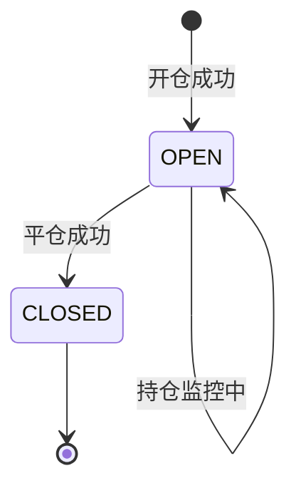
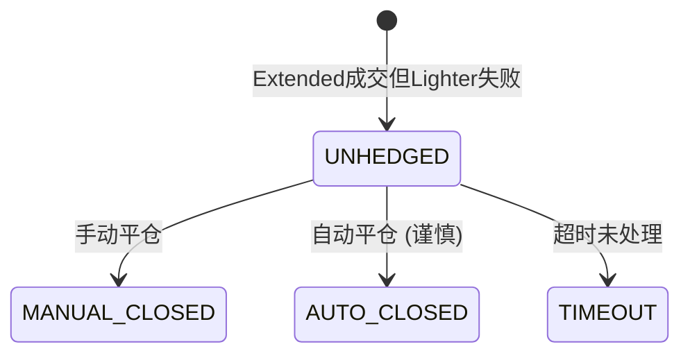
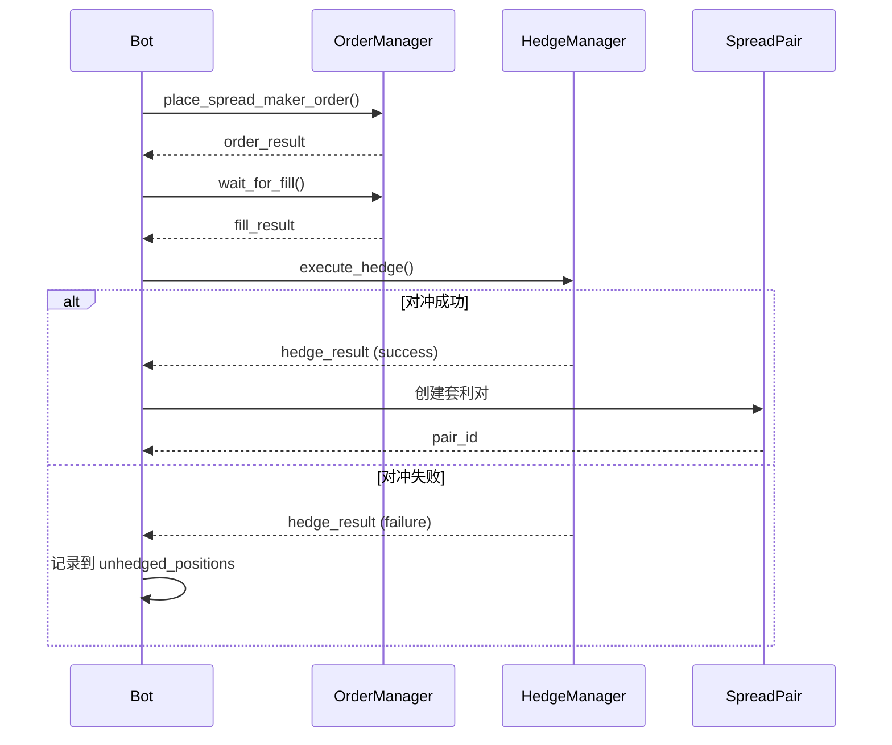
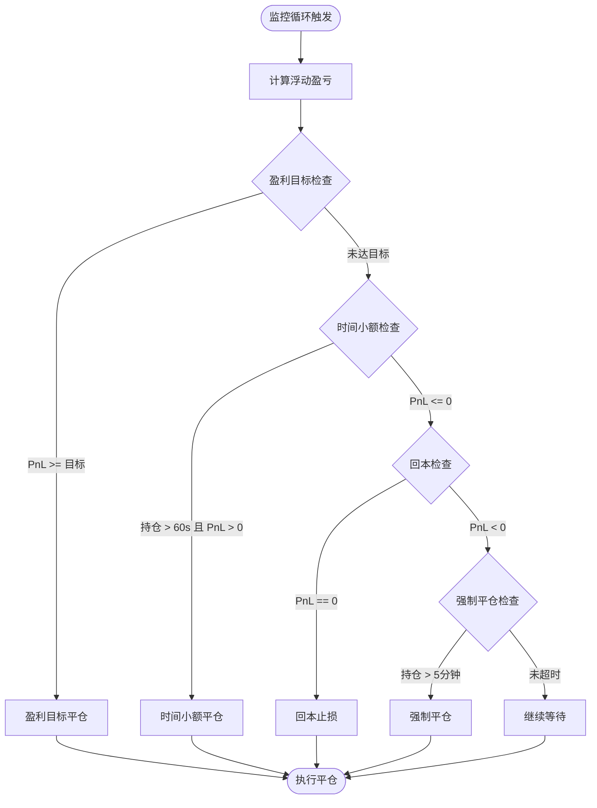
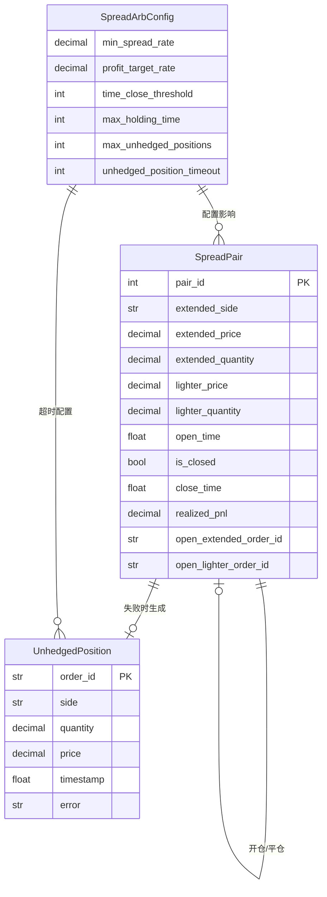

# 数据模型: 优化价差套利策略

**功能**: 002-optimize-spread-arb
**日期**: 2026-01-08
**状态**: 完成

## 概述

本文档定义价差套利策略优化的数据模型,包括实体、字段、关系、验证规则和状态转换。

---

## 1. 核心实体

### 1.1 SpreadPair (套利对)

表示一个完整的套利持仓,由 Extended 仓位和 Lighter 对冲仓位组成。

#### 字段定义

| 字段名 | 类型 | 说明 | 验证规则 |
|--------|------|------|----------|
| `pair_id` | `int` | 套利对唯一标识 | > 0, 自增 |
| `extended_side` | `str` | Extended 方向 | 枚举: 'buy', 'sell' |
| `extended_price` | `Decimal` | Extended 开仓价格 | > 0, 精度8位 |
| `extended_quantity` | `Decimal` | Extended 开仓数量 | > 0, 精度4位 |
| `lighter_price` | `Decimal` | Lighter 开仓价格 | > 0, 精度8位 |
| `lighter_quantity` | `Decimal` | Lighter 开仓数量 | == extended_quantity |
| `open_time` | `float` | 开仓时间戳 | Unix timestamp |
| `is_closed` | `bool` | 是否已平仓 | 默认 False |
| `close_time` | `float \| None` | 平仓时间戳 | 平仓后设置 |
| `close_extended_price` | `Decimal \| None` | Extended 平仓价格 | 平仓后设置 |
| `close_lighter_price` | `Decimal \| None` | Lighter 平仓价格 | 平仓后设置 |
| `realized_pnl` | `Decimal \| None` | 实现盈亏 (USDT) | 平仓后计算 |

#### 新增字段 (本功能)

| 字段名 | 类型 | 说明 | 验证规则 |
|--------|------|------|----------|
| `open_extended_order_id` | `str \| None` | Extended 开仓订单ID | 用于日志记录 |
| `open_lighter_order_id` | `str \| None` | Lighter 开仓订单ID | 用于日志记录 |
| `close_extended_order_id` | `str \| None` | Extended 平仓订单ID | 平仓后记录 |
| `close_lighter_order_id` | `str \| None` | Lighter 平仓订单ID | 平仓后记录 |

#### 计算属性

```python
@property
def lighter_side(self) -> str:
    """Lighter 方向 (与 Extended 相反)"""
    return 'sell' if self.extended_side == 'buy' else 'buy'

@property
def holding_time(self) -> float:
    """持仓时间 (秒)"""
    if self.is_closed:
        return self.close_time - self.open_time
    return time.time() - self.open_time

@property
def open_spread(self) -> Decimal:
    """开仓价差 (绝对值)"""
    if self.extended_side == 'buy':
        return self.lighter_price - self.extended_price
    else:
        return self.extended_price - self.lighter_price

@property
def open_spread_rate(self) -> Decimal:
    """开仓价差率"""
    if self.extended_side == 'buy':
        return self.open_spread / self.extended_price
    else:
        return self.open_spread / self.lighter_price
```

#### 状态转换



#### 方法签名

```python
def calculate_unrealized_pnl(
    self,
    current_extended_price: Decimal,
    current_lighter_price: Decimal
) -> Decimal:
    """计算未实现盈亏"""

def close(
    self,
    close_extended_price: Decimal,
    close_lighter_price: Decimal
) -> Decimal:
    """标记已平仓并返回实现盈亏"""

def to_dict(self) -> Dict[str, Any]:
    """转换为字典 (用于日志记录)"""
```

---

### 1.2 UnhedgedPosition (未对冲持仓)

表示仅在 Extended 成交但 Lighter 对冲失败的订单。

#### 字段定义

| 字段名 | 类型 | 说明 | 验证规则 |
|--------|------|------|----------|
| `order_id` | `str` | Extended 订单ID | 非空 |
| `side` | `str` | 订单方向 | 枚举: 'buy', 'sell' |
| `quantity` | `Decimal` | 成交数量 | > 0 |
| `price` | `Decimal` | 成交价格 | > 0 |
| `timestamp` | `float` | 成交时间戳 | Unix timestamp |
| `error` | `str` | 对冲失败原因 | 非空 |

#### 状态转换



---

### 1.3 SpreadArbConfig (配置对象)

包含所有可配置的套利策略参数。

#### 字段定义

| 字段名 | 类型 | 默认值 | 说明 |
|--------|--------|--------|------|
| **基础配置** |
| `ticker` | `str` | 'ETH' | 交易对符号 |
| `order_quantity_usdt` | `Decimal` | 35 | 单次下单金额 (USDT) |
| **价差配置** |
| `min_spread_rate` | `Decimal` | 0.0005 | 最小价差率 (0.05%) |
| `latency_buffer` | `Decimal` | 0.0001 | 延迟缓冲 (0.01%) |
| **持仓管理** |
| `max_open_pairs` | `int` | 3 | 最大同时持仓数 |
| `max_total_position_usdt` | `Decimal` | 25 | 最大总持仓 |
| **平仓策略 (本功能新增)** |
| `profit_target_rate` | `Decimal` | 0.0005 | 盈利目标 (0.05%) |
| `time_close_threshold` | `int` | 60 | 时间平仓阈值 (秒) |
| `max_holding_time` | `int` | 300 | 最大持仓时间 (5分钟) |
| `enable_time_close` | `bool` | True | 启用时间平仓 |
| `enable_profit_target` | `bool` | True | 启用盈利目标 |
| **风险控制** |
| `max_unhedged_positions` | `int` | 0 | 最大未对冲持仓数 |
| `unhedged_position_timeout` | `int` | 60 | 未对冲超时 (秒) |
| `auto_close_unhedged` | `bool` | False | 自动平仓未对冲 |
| **其他** |
| `enable_reconciliation` | `bool` | True | 启用持仓对账 |
| `reconciliation_interval` | `int` | 60 | 对账间隔 (秒) |

#### 验证规则

```python
def __post_init__(self):
    # 价差率验证
    assert self.min_spread_rate > 0, "min_spread_rate 必须大于 0"
    assert self.min_spread_rate > self.latency_buffer, "必须大于延迟缓冲"

    # 持仓限制验证
    assert self.max_open_pairs > 0, "max_open_pairs 必须大于 0"
    assert self.order_quantity_usdt > 0, "order_quantity_usdt 必须大于 0"

    # 平仓策略验证
    assert self.profit_target_rate > 0, "profit_target_rate 必须大于 0"
    assert self.time_close_threshold > 0, "time_close_threshold 必须大于 0"
    assert self.max_holding_time > self.time_close_threshold, "max_holding_time 必须大于 time_close_threshold"
```

#### 环境变量支持

```python
@classmethod
def from_env(cls) -> 'SpreadArbConfig':
    """从环境变量加载配置"""
    return cls(
        min_spread_rate=Decimal(os.getenv('MIN_SPREAD_RATE', '0.0005')),
        profit_target_rate=Decimal(os.getenv('PROFIT_TARGET_RATE', '0.0005')),
        time_close_threshold=int(os.getenv('TIME_CLOSE_THRESHOLD', '60')),
        max_holding_time=int(os.getenv('MAX_HOLDING_TIME', '300')),
        unhedged_position_timeout=int(os.getenv('UNHEDGED_TIMEOUT', '60')),
        # ... 其他配置
    )
```

---

## 2. 数据流

### 2.1 开仓流程



### 2.2 平仓决策流程



---

## 3. 关系图



---

## 4. 验证规则汇总

### 4.1 字段级验证

| 实体 | 字段 | 规则 | 错误处理 |
|------|------|------|----------|
| SpreadPair | extended_price | > 0 | ValueError |
| SpreadPair | extended_quantity | > 0 | ValueError |
| SpreadPair | lighter_quantity | == extended_quantity | AssertionError |
| SpreadPair | pair_id | 唯一性 | 自动递增 |
| UnhedgedPosition | timestamp | < current_time | 拒绝 |

### 4.2 业务规则验证

| 规则 | 描述 | 实现位置 |
|------|------|----------|
| 单边持仓限制 | len(unhedged_positions) <= max | `_strategy_loop()` |
| 价差阈值 | spread_rate >= min_spread_rate | `calculator.py` |
| 盈利目标 | unrealized_pnl >= profit_target | `_check_force_close()` |
| 时间限制 | holding_time <= max_holding_time | `_check_force_close()` |

---

## 5. 序列化

### 5.1 日志输出格式

**开仓日志**:
```json
{
  "event": "open_pair",
  "pair_id": 1,
  "extended": {
    "side": "buy",
    "price": 2500.50,
    "quantity": 0.014,
    "order_id": "EXT_12345"
  },
  "lighter": {
    "side": "sell",
    "price": 2501.75,
    "quantity": 0.014,
    "order_id": "LT_67890"
  },
  "spread": {
    "absolute": 1.25,
    "rate": 0.0005
  },
  "timestamp": 1704700800.0
}
```

**平仓日志**:
```json
{
  "event": "close_pair",
  "pair_id": 1,
  "reason": "profit_target",
  "holding_time": 45.2,
  "pnl": 0.875,
  "close_prices": {
    "extended": 2501.25,
    "lighter": 2500.00
  }
}
```

---

## 6. 测试数据模型

### 6.1 测试夹具

```python
# tests/fixtures.py
import pytest
from decimal import Decimal
from spread.spread_pair import SpreadPair
from spread.config import SpreadArbConfig

@pytest.fixture
def sample_config():
    return SpreadArbConfig(
        ticker='ETH',
        order_quantity_usdt=Decimal('35'),
        min_spread_rate=Decimal('0.0005'),
        profit_target_rate=Decimal('0.0005'),
        time_close_threshold=60
    )

@pytest.fixture
def sample_spread_pair():
    return SpreadPair(
        pair_id=1,
        extended_side='buy',
        extended_price=Decimal('2500.00'),
        extended_quantity=Decimal('0.014'),
        lighter_price=Decimal('2501.25'),
        lighter_quantity=Decimal('0.014')
    )
```

---

## 7. 迁移策略

### 7.1 向后兼容性

- 新增字段使用可选类型 (`Optional`)
- 默认值确保现有代码继续工作
- 配置类 `from_env()` 方法逐步迁移

### 7.2 数据迁移

无需数据库迁移,因为:
- 状态保存在内存中
- 重启后重新建立持仓
- 日志文件追加格式

---

## 总结

本数据模型定义了价差套利策略优化的核心实体和关系,支持:
1. ✅ 单边持仓风险追踪
2. ✅ 可配置的价差阈值
3. ✅ 多层平仓决策
4. ✅ 完整的交易价格记录

所有实体遵循现有代码风格,使用 Decimal 进行金融计算,通过返回值传递错误信息。
